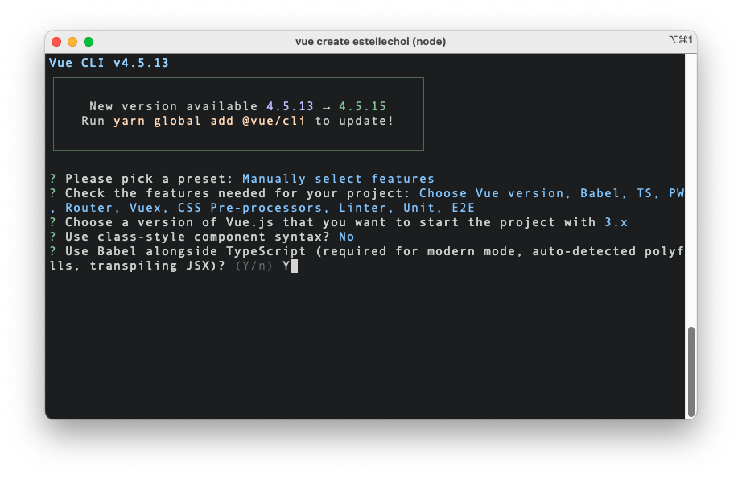

# Vue CLI로 Vue3 + TypeScript 프로젝트 셋업하기

<br>

1. `@vue/cli` 버전 확인 & 업데이트
2. `@vue/cli`로 Vue3 프로젝트 생성하기
3. TypeScript에게 `.vue` 확장자를 가진 모듈의 Type 알려주기: `shims-vue.d.ts`

<br>

## 1. `@vue/cli` 버전 확인 & 업데이트

기존에 전역 설치된 `@vue/cli`가 있다면, 아래 명령어를 사용하여 최신 버전으로 업데이트합니다.

```
# npm
npm update -g @vue/cli

# yarn
yarn global upgrade --latest @vue/cli
```

<br>

버전 업데이트가 정상적으로 실행되었는지 확인하기 위해 아래 명령어를 사용하여 버전을 확인합니다.

```
vue --version
```

<br>

만약 버전 업데이트가 되지 않았다면 기존에 설치된 `@vue/cli`를 삭제한 후 다시 설치하는 방법이 있습니다. 아래와 같이 패키지매니저 명령어를 사용하여 삭제하시거나,

```
# npm
npm uninstall -g @vue/cli

# yarn
yarn global remove @vue/cli
```

<br>

위 방법도 정상 작동하지 않는다면, 전역 설치된 `@vue/cli`가 위치한 아래의 경로로 이동합니다. (MacOS 기준)

```
# npm
cd /usr/local/lib/node_modules

# yarn
cd ~/.config/yarn/global/node_modules
```

<br>

그다음 `ls` 명령어를 사용하여 `@vue` 폴더가 조회되는지 확인하신 후, 아래 명령어를 사용하여 기존에 설치되어있던 `@vue` 라이브러리 폴더를 삭제합니다.

```
rm -rf @vue
```

<br>

그리고 재설치.

```
#npm
npm install -g @vue/cli

# yarn
yarn global add @vue/cli
```

<br>

## 2. `@vue/cli`로 Vue3 프로젝트 생성하기

### 2-1. `vue create`

`@vue/cli` 준비가 완료되었으면, 프로젝트를 생성하고자하는 경로로 이동한 후, 다음 명령어를 사용하여 Vue 프로젝트 생성을 시작합니다.

```
vue create project-name
```

<br>

### 2-2. Preset 선택

첫 번째 단계로 프로젝트 Preset을 선택할 수 있는데요, 저는 `Manually select features`를 선택해서 Preset에 포함시킬 라이브러리들을 직접 선택했습니다.


<br>

`Manually select features`를 선택했다면, 필요한 기능들을 선택합니다. 저는 다음 항목들을 모두 사용하기 위해 모두 선택했습니다.


<br>

### 2-3. Vue 버전 선택

Vue3를 사용하기 위해 `3.x`를 선택합니다.


<br>

### 2-4. 컴포넌트 스타일 선택

Class 스타일 컴포넌트를 사용하겠습니까? N.


<br>

### 2-5. Babel 사용여부 선택

[Babel](https://babeljs.io/docs/en/)을 사용하겠습니까? Y. Babel은 크로스 브라우징을 위한 JavaScript 컴파일러입니다.



<br>

### 2-6. `vue-router` 모드 선택

`vue-router`에서 [`history` 모드](https://router.vuejs.org/guide/essentials/history-mode.html)를 사용하겠습니까? Y. `vue-router`의 디폴트 모드는 `hash` 모드입니다.


<br>

### 2-7. CSS 전처리기 선택

그 다음, CSS 전처리기 라이브러리를 선택합니다. 저는 [Dart Sass](https://sass-lang.com/dart-sass)를 사용하기 위해 `Sass/SCSS (with dart-sass)`를 선택했습니다. 참고로 LibSass, Node Sass는 2020년 10월부로 Deprecation이 공식적으로 발표되었으니 참고해주세요!

> we’ve come to the conclusion that it’s time to officially declare that LibSass and the packages built on top of it, including Node Sass, are deprecated. - Sass


<br>

### 2-8. 린터 + 포매터 선택

이제 린터와 포매터를 선택합니다. 저는 [`ESLint`](https://eslint.org/)와 [`Prettier`](about:blank)를 선택했습니다. 참고로 [`TSLint`](https://www.npmjs.com/package/tslint)는 Deprecated 되었습니다.


<br>

그 다음 린터를 적용할 시점을 선택합니다. 저는 `Lint on save`를 선택했습니다.


<br>

### 2-9. 테스트 도구 선택

다음 단계는 테스트 도구를 선택하는 것입니다. [단위 테스트](https://martinfowler.com/bliki/UnitTest.html)에 사용할 라이브러리를 선택합니다.


<br>

그 다음 [E2E 테스트](https://www.katalon.com/resources-center/blog/end-to-end-e2e-testing/) 도구도 선택합니다.


<br>

### 2-10. 라이브러리 환경설정 방법 선택

마지막으로 Babel, ESLint 등 각종 라이브러리에 대한 환경설정 방법을 선택합니다. `package.json` 파일에서 지정된 필드를 사용해도 되지만, 저는 한 파일에서 모두 관리하는 것보다 라이브러리별로 설정 파일을 두고 관리하는 것이 편하고 안전하다고 생각하기 때문에 다음과 같이 선택했습니다.


<br>

프로젝트 생성이 완료되면 다음 명령어를 사용하여 프로젝트 루트 경로로 이동합니다.

```
cd project-name
```

<br>

그 다음 프로젝트 루트 경로에 있는 `package.json` 파일을 확인해보면, `@vue/cli`를 사용하여 프로젝트 생성시 선택했던 옵션들에 따라 기본 셋업이 되어있습니다.

```json
{
	"name": "estellechoi",
	"version": "0.1.0",
	"private": true,
	"scripts": {
		"serve": "vue-cli-service serve",
		"build": "vue-cli-service build",
		"test:unit": "vue-cli-service test:unit",
		"test:e2e": "vue-cli-service test:e2e",
		"lint": "vue-cli-service lint"
	},
	"dependencies": {
		"core-js": "^3.6.5",
		"register-service-worker": "^1.7.1",
		"vue": "^3.0.0",
		"vue-router": "^4.0.0-0",
		"vuex": "^4.0.0-0"
	},
	"devDependencies": {
		"@types/jest": "^24.0.19",
		"@typescript-eslint/eslint-plugin": "^4.18.0",
		"@typescript-eslint/parser": "^4.18.0",
		"@vue/cli-plugin-babel": "~4.5.0",
		"@vue/cli-plugin-e2e-cypress": "~4.5.0",
		"@vue/cli-plugin-eslint": "~4.5.0",
		"@vue/cli-plugin-pwa": "~4.5.0",
		"@vue/cli-plugin-router": "~4.5.0",
		"@vue/cli-plugin-typescript": "~4.5.0",
		"@vue/cli-plugin-unit-jest": "~4.5.0",
		"@vue/cli-plugin-vuex": "~4.5.0",
		"@vue/cli-service": "~4.5.0",
		"@vue/compiler-sfc": "^3.0.0",
		"@vue/eslint-config-prettier": "^6.0.0",
		"@vue/eslint-config-typescript": "^7.0.0",
		"@vue/test-utils": "^2.0.0-0",
		"eslint": "^6.7.2",
		"eslint-plugin-prettier": "^3.3.1",
		"eslint-plugin-vue": "^7.0.0",
		"prettier": "^2.2.1",
		"sass": "^1.26.5",
		"sass-loader": "^8.0.2",
		"typescript": "~4.1.5",
		"vue-jest": "^5.0.0-0"
	}
}
```

<br>

## 3. TypeScript에게 `.vue` 확장자를 가진 모듈의 Type 알려주기: `shims-vue.d.ts`

`src/shims-vue.d.ts` 파일은 TypeScript가 `.vue` 확장자를 가진 모듈을 어떤 Type으로 해석해야하는지 명시하는 용도입니다. `.ts` 파일 내에서 `.vue` 확장자의 파일을 임포트하려는 경우, TypeScript는 기본적으로 이 모듈에 대한 Type을 알지 못하기 때문에 `Vue` Type으로 해석하면 된다고 알려주는 식이죠.

```typescript
/* eslint-disable */
declare module "*.vue" {
	import type { DefineComponent } from "vue";
	const component: DefineComponent<{}, {}, any>;
	export default component;
}
```

<br>

---

### References

- [Installation | Vue.js](https://v3.vuejs.org/guide/installation.html#release-notes)
- [Vue3 Migration Guide | Vue.js](https://v3.vuejs.org/guide/migration/introduction.html)
- [Intro to the TSConfig Reference | TypeScript](https://www.typescriptlang.org/tsconfig)
- [TypeScript: Ambient modules for Webpack loaders | fettblog.eu](https://fettblog.eu/typescript-modules-for-webpack/)
