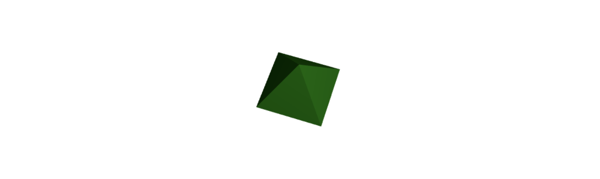
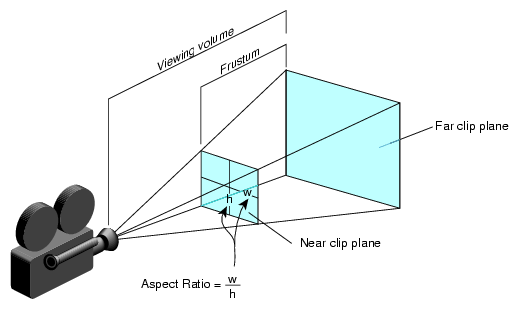
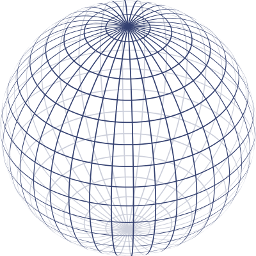
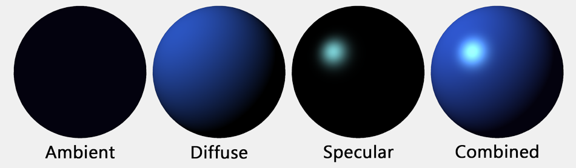
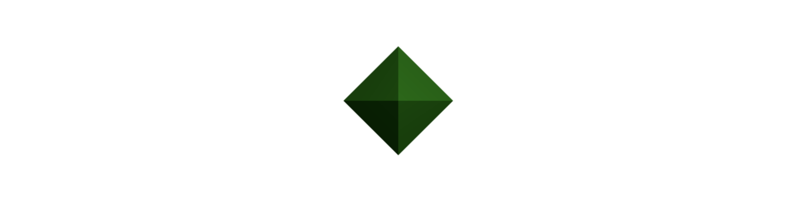

# three.js로 WebGL 시작하기

> 알아야할 사전지식이 많은 WebGL, three.js 라이브러리를 사용하여 일단 구현부터 해보고 원리를 하나하나 파보는 방식으로 알아보고자 합니다. 제 개인적인 공부, 추후 참고하기 위한 기록의 목적으로 작성했습니다.

<br />

## 무대, 물체, 카메라, 빛

WebGL 라이브러리인 three.js를 사용하면 비교적 쉽게 3D 애니메이션을 구현할 수 있습니다. 4가지 개념만 이해하면, 라이브러리에서 제공하는 객체와 함수를 사용하여 간단한 애니메이션을 뚝 딱 뚝 딱 만들어낼 수 있죠. 그 4가지 개념이 무엇이냐면,

- 무대 (Scene)

- 물체 (Mesh)

- 카메라 (Camera)

- 빛 (Light)

<br />

아래 사진은 처음 three.js 라이브러리를 사용해보며 예제로 만들어본 결과물입니다. 녹색의 팔면체가 일정한 속도로 회전하고 있는 예제이고요, 이 결과물에도 위에 소개한 4가지 개념이 숨어있습니다. 녹색의 팔면체가 물체(Mesh)이고요, 이 팔면체가 위치하는 가상의 공간이 무대(Scene)입니다. 우리 인간들이 살고있는 지구를 하나의 물체라고 했을 때, 지구가 속한 우주 공간을 무대로 간주하는 것과 비슷하죠.

무대 공간이 사방으로 무한히 뻗어있다고 가정해봅시다. 마치 우주처럼요. 이제 어떤 특정한 위치로부터 녹색 팔면체를 관찰할 필요가 있습니다. 영화를 찍을 때 카메라를 어디에 두고 어느 각도에서 배우들을 촬영할지 결정하듯이, 팔면체의 어느 부분을 어느 각도에서 촬영할 것인지 결정하는거죠. 이게 three.js에서의 카메라(Camera) 개념입니다.

마지막으로 빛(Light)이 필요합니다. 3D 물체가 실제로 3D처럼 보이려면 빛이 꼭 필요하죠. 빛을 받는 쪽은 밝게 보이고, 반대편은 어둡게 보이기 때문입니다. 우리가 살고 있는 현실 세계처럼요. 낮이든 밤이든 어딘가 빛이 있기 때문에 모든 사물들이 입체적으로 보이는 것이죠.



<br />

## three.js 시작하기

이제 본격적으로 시작해봅시다. 아래와 같이 기본적인 마크업을 하고요.

```html
<!-- 우리의 결과물이 담길 곳-->
<div id="three"></div>
```

<br />

### three.js 설치하기

#### NPM

아래와 같이 NPM으로 설치해서 사용할 수 있습니다.

```
npm install --save three
```

<br />

```javascript
import * as THREE from "three";
```

<br />

`controls`, `loaders`, `post-processing effects` 등의 인기있는 기능들이 모두 `three` 모듈에서 직접 제공되지는 않습니다. 대신, 하위 디렉토리인 [`three/examples/jsm`](https://github.com/mrdoob/three.js/tree/dev/examples/jsm)에서 얻을 수 있죠. 예를 들어, `OrbitControls` 객체를 사용하려면 아래와 같이 해당 객체가 속한 하위 디렉토리로부터 해당 파일을 직접 임포트해야합니다.

<br />

```javascript
import { OrbitControls } from "three/examples/jsm/controls/OrbitControls.js";
```

<br />

#### CDN

CDN을 사용할 수도 있습니다. `<VERSION>` 부분에는 사용하고자하는 라이브러리 버전을 넣어주세요. 다른 파일들을 임포트할 때도 동일한 버전을 참조해야합니다. 모듈을 사용하므로 `<script>` 태그에 `type="module"`을 명시하고요.

```html
<script type="module">
	import * as THREE from "https://unpkg.com/three@<VERSION>/build/three.module.js";
	import { OrbitControls } from "https://unpkg.com/three@<VERSION>/examples/jsm/controls/OrbitControls.js";
</script>
```

<br />

#### Static hosting

혹은 [three.js](https://threejs.org/docs/index.html#manual/en/introduction/Creating-a-scene)를 다운로드 받고, `js` 디렉토리에 위치시킨 후, 아래와 같이 직접 참조해서 빠르게 사용해볼 수 있습니다.

```html
<script src="js/three.js"></script>
<script>
	// 이곳에 코드를 작성할거에요.
</script>
```

<br />

## 무대(Scene) 만들기

먼저 무대(Scene)를 만들어야합니다. 우리가 창조할 무언가가 담길 공간이죠. 아래와 같이 한 줄의 코드로 끝! `THREE` 객체의 `Scene()` 메소드를 호출하면 무대를 반환합니다.

```javascript
const scene = new THREE.Scene();
```

<br />

### 렌더러(Renderer) 만들기

무대와 더불어, 렌더러(Renderer), 말그대로 렌더(Render)를 해줄 놈이 필요합니다. 우리가 무대 내에 물체와 카메라, 빛 모든 것을 갖춘다해도, 완성된 무대를 브라우저가 렌더링하도록 알려줄 장치가 필요한거죠.

아래와 같이 [`WebGLRenderer`](https://threejs.org/docs/#api/en/renderers/WebGLRenderer.antialias)를 사용해보죠. 인자로 속성 값들을 담은 객체를 넘겨주면 되는데요, 이번 예제에서 지정한 두 가지 속성은 `alpha`와 `antialias`입니다. 즉, 투명한 효과를 사용할거냐, Antialias(선과 모서리를 매끄럽게 나타냄으로써 시각적인 오류를 바로잡는 기법)을 사용할거냐 정해줍니다. 두 속성 모두 기본값은 `false`이고요, `WebGLRenderer()` 호출시 인자를 넘기지 않으면 기본값이 적용됩니다.

> [`WebGLRenderer` 생성자의 객체 인자에 담을 수 있는 속성들 모두 보기](https://threejs.org/docs/#api/en/renderers/WebGLRenderer.antialias)

<br>

```javascript
// WebGLRenderer 만들기
const renderer = new THREE.WebGLRenderer({
	alpha: true,
	antialias: true,
});

const WIDTH = 300;
const HEIGHT = 300;

// 사이즈 지정 (px)
renderer.setSize(WIDTH, HEIGHT);
```

<br>

자 렌더러 설정은 일단 여기까지 하고, 나중에 이 렌더러를 사용해서 우리가 원하는 시점에 우리의 무대를 브라우저에 렌더링 시킬겁니다.

<br>

## 카메라(Camera) 만들기

이제 카메라를 만들어보죠. 카메라를 만들기 위해서는 먼저, 아래와 같이 몇가지 값들을 정해야합니다.

- 시야각(Field of view, FOV) (단위 : `deg`)

- 시야의 비율(Aspect ratio) (가로 / 세로)

- 카메라와 물체 사이의 최소 거리

- 카메라와 물체 사이의 최대 거리

<br>



<br>

```javascript
const WIDTH = 300;
const HEIGHT = 300;

const FIELD_OF_VIEW = 20; // 시야각 : 20deg
const ASPECT_RATIO = WIDTH / HEIGHT; // 시야의 가로:세로 비율 : 1:1
const NEAR = 0.1; // 카메라-물체 사이의 최소 거리 : 0.1
const FAR = 1000; // 카메라-물체 사이의 최대 거리 : 1000
```

<br>

위에서 지정한 값들을 인자로 하여 아래와 같이 카메라를 만드는 메소드를 호출합니다. `THREE` 객체는 몇가지 다른 종류의 카메라들을 제공하는데요, 이번 예제에서는 그중 `PerspectiveCamera`를 사용해보죠. 시야각, 가로세로 시야 비율, 물체(피사체)와의 최소거리, 최대거리 순으로 인자를 넘깁니다.

```javascript
const camera = new THREE.PerspectiveCamera(
	FIELD_OF_VIEW,
	ASPECT_RATIO,
	NEAR,
	FAR
);
```

<br />

## 물체(Mesh) 만들기

지금까지 무대를 만들고, 카메라를 설치했습니다. 이제 촬영할 피사체를 만들어야겠죠. 컴퓨터 그래픽에서 3D 물체를 구현하려면 두 가지 요소, 기하학(Geometry)과 물질(Material)을 이해해야 합니다. 무언가 장황한 용어들이 사용되고 있지만 쉽게 말해 뼈대를 구현하고, 그 뼈대들을 연결하는 면을 구현하면 됩니다. 이렇게 뼈대와 면으로 이루어진 물체를 메시(Mesh)라고 합니다.

<br />

```
기하학(Geometry) + 물질(Material) = 메시(Mesh)
```

<br />

예를 들어 공모양의 물체(메시)는 아래와 같이 수많은 뼈대로 이루어져있습니다. 아래와 같은 뼈대를 WebGL에서 기하학(Geometry)라고 합니다.



<br />

그리고 아래와 같이 다양한 면들로 뼈대를 연결하여 실제로 공 모양을 구현할 수 있는데, 면에 해당하는 부분을 WebGL에서는 물질(Material)이라고 하죠.



<br />

### 기하학(Geometry)

뼈대는 어떻게 구현할까요? 꼭짓점(Vertex), 그리고 각 꼭짓점들을 잇는 선(Face)들로 구성됩니다. 자세한 얘기는 뒤에 하기로하고, three.js의 서비스를 이용해보죠. three.js는 자주 사용되는 도형들의 뼈대를 기본적으로 제공합니다. 매번 꼭짓점과 선들을 연결하여 손수 만들 필요가 없죠.

<br />

짠! 아래와 같이 하면 팔면체 모양의 뼈대를 얻을 수 있습니다.

```javascript
const RADIUS = 40;
const octGeometry = new THREE.OctahedronGeometry(RADIUS, 0);
```

<br />

### 물질(Material)

팔면체 모양의 뼈대에 면을 채워줍시다. 여기에서는 `MeshLambertMaterial`을 사용해보죠.

```javascript
const material = new THREE.MeshLambertMaterial({ color: 0x00ff00 });
```

<br />

### 메시(Mesh)

위에서 만든 뼈대와 면으로 메시(Mesh)를 완성합니다.

```javascript
// Mesh = Geometry + Material
const mesh = new THREE.Mesh(octGeometry, material);
```

<br />

### 무대에 피사체 추가하기

위와 같이 피사체를 만들었으면, 무대에 추가해줍니다. 그리고 무대 내에서의 위치를 지정해주는데요, 별도로 지정하지 않으면 기본 위치는 `(0, 0, 0)` 입니다. 저는 피사체의 위치를 z축으로 `-40` 지점에 위치시켰어요. (위에서 값이 `40`인 `RADIUS` 변수를 선언했었죠)

```javascript
scene.add(mesh);

mesh.position.z = -RADIUS * 10;
```

<br />

## 빛(Light) 추가하기

마지막으로 무대에 조명을 설치해봅시다. 우리가 만든 피사체가 더 입체적으로 보이도록 말이죠. 저는 조명이 무대의 우측상단, z축으로는 `30` 이동한 지점에 위치하도록 설정했고요, 마지막으로 `scene.add()` 메소드를 사용하여 무대에 추가했습니다.

```javascript
// 인자 : (색, 빛의 강도)
const pointLight = new THREE.PointLight(0xffffff, 0.5);
pointLight.position.x = 100;
pointLight.position.y = 100;
pointLight.position.z = 30;

scene.add(pointLight);
```

<br />

## 완성된 무대를 렌더링하기

위에서 우리의 무대를 실제로 렌더시키기 위해 렌더러(Renderer)를 만들었었죠? 이제 이 렌더러를 사용하여 실제로 브라우저에 무대를 띄워볼건데요, 이를 위해서는 HTML 문서에 `<canvas>` 태그를 사용하여 무대를 삽입해야 합니다. 직접 `<canvas>` 태그를 마크업하는건 아니고요, 무대를 보여줄 컨테이너 요소의 하위에 `renderer.domElement`를 추가하면 됩니다. 그럼 `renderer.domElement`가 브라우저에서 `<canvas>` 태그로 렌더링됩니다.

```javascript
// Container DOM
const container = document.getElementById("three");
// <canvas> element
container.appendChild(renderer.domElement);
```

<br />

자 이제, 진짜로 렌더링 시키죠.

```javascript
renderer.render(scene, camera);
```

<br />

아래와 같이 되었나요?



<br />

## 피사체에 애니메이션 더하기

이제 팔면체에 애니메이션을 추가해보겠습니다. 위와 같이 그냥 렌더링시키지 말고, [`window.requestAnimationFrame()`](https://developer.mozilla.org/en-US/docs/Web/API/window/requestAnimationFrame) API를 사용하여 재귀호출하는 함수를 작성하세요. 똑같은 무대를 반복적으로 다시 렌더시키는 원리인데요, 렌더시킬 때마다 물체(`mesh`)만 조금씩(`speed`) 회전(`rotation`)시키는 방법이죠.

<br />

```javascript
function update() {
	const speed = 0.03;
	mesh.rotation.x += speed;
	mesh.rotation.y += speed;

	renderer.render(scene, camera);
	window.requestAnimationFrame(update);
}

update();
```

<br />

자, 이제 물체가 부드럽게 회전하고 있나요? 여기까지 성공했으면 three.js에 입문했다고 볼 수 있겠죠?


<br />

---

### References

- [three.js docs](https://threejs.org/docs/index.html#manual/en/introduction/Creating-a-scene)

<br />

### Images from

- [WebGL and Javascript: Drawing Simple 3D Shapes using Three.js](https://wowmoron.wordpress.com/2013/10/21/webgl-and-javascript-drawing-simple-3d-shapes-using-three-js/)
- [WebGL Materials](https://steelcase.clara.io/learn/user-guide/lighting_shading/materials/material_types/webgl_materials)
- [Chapter 9. Viewing the Scene](https://techpubs.jurassic.nl/manuals/nt/developer/Cos3C_PG/sgi_html/ch09.html)
