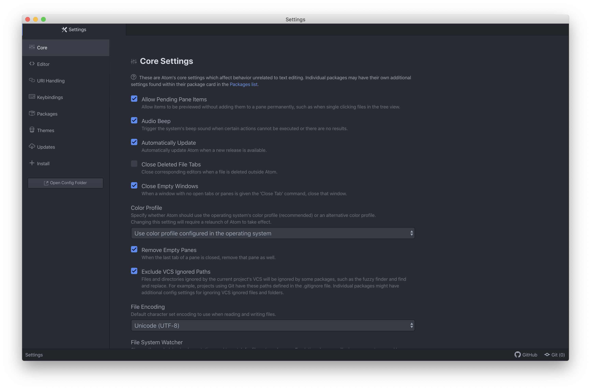
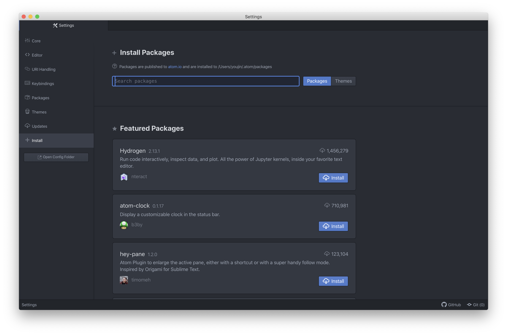
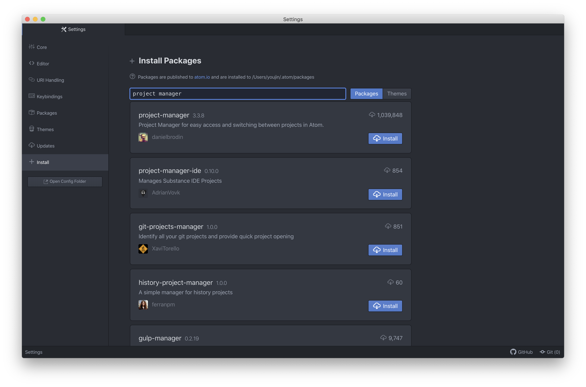
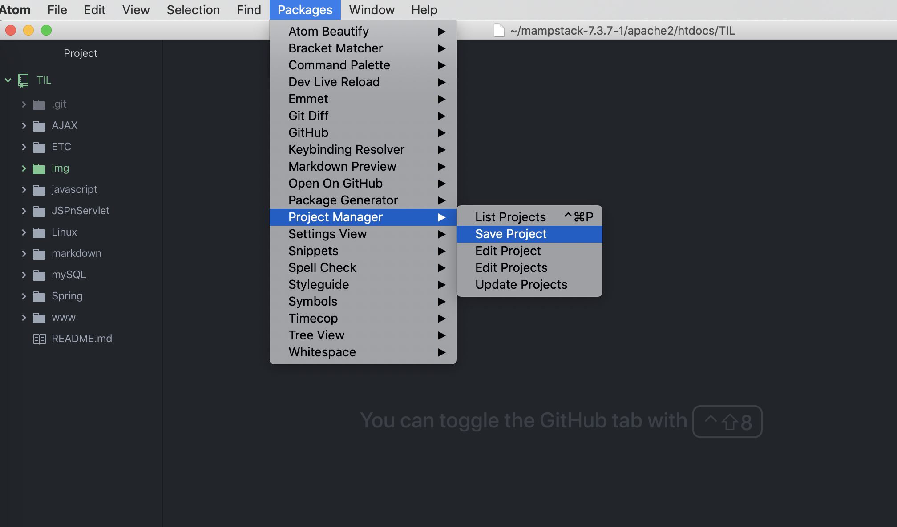
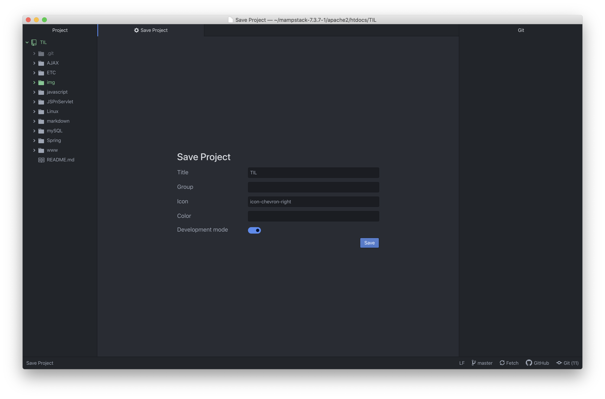
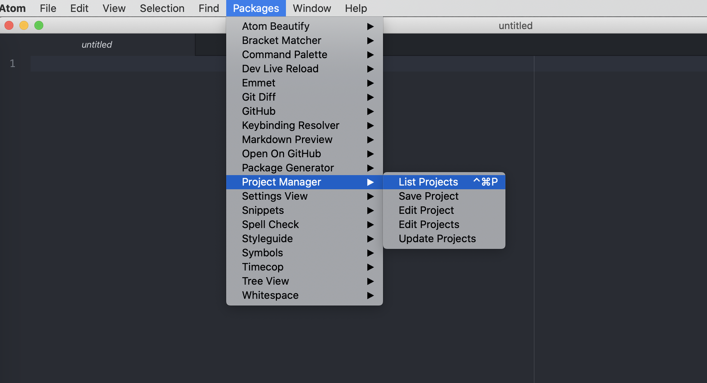
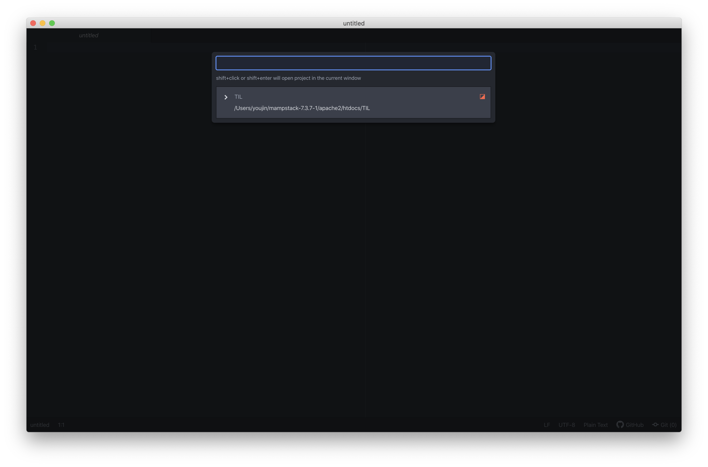

# 아톰(Atom) 편집기에서 작업 내용 유지하기
> Mac OS 에서 아톰 편집기를 사용하다가 종료하면 작업 내용이 유지되지 않는다.
> Project Manager 라는 패키지를 알게 맥북을 쓰는 내 친구들을 위해 기록해본다..

## 1. Project Manager 패키지 설치
  - 이 패키지를 설치하기 전에 아톰을 응용 프로그램에 넣어준다.
  - 아톰을 열면, 역시나 작업 내용이 유지되지 않고 깨끗한 창이 열린다.
  - 아래와 같이 환경설정을 연다. (단축키는 `cmd + ,` 이다.)

  

  - 가장 아래에 있는 Install 탭을 클릭하면 Install Packages 탭이 열린다.

  

  - Project Manager 를 검색한다. (다운로드 수가 많다.. 모두 맥 사용자들인가 ?)
  - Install 버튼을 클릭하여 설치한다.

 

## 2. Project Manager 패키지로 프로젝트 저장하기

  

  - 테스트 하기 위해 폴더를 하나 연다. (아직 아톰을 재시작하면 안된다 !)
  - 열려 있는 작업 폴더를 저장하기 위해 [Packages] - [Project Manager] - [Save Project] 순으로 클릭한다.

  

  - 아래와 같은 창이 열리는데, 프로젝트 이름을 입력하고 Save 버튼을 클릭하여 저장한다.

  

  - 이제 아톰을 종료하고 재시작한다.
  - 기대와 달리 작업 폴더가 보이지 않는다.. 아쉽지만, 저장된 프로젝트 리스트를 열어서 작업할 프로젝트를 직접 열어주어야 한다.
  - 리스트를 열기 위해 [Packages] - [Project Manager] - [List Projects] 순으로 클릭한다. (단축키는 `ctrl + cmd + p`)

  

  - 아래와 같이 저장된 프로젝트 리스트를 확인할 수 있고, 리스트 중에서 작업할 프로젝트를 선택하면 된다!

  

 

### Reference

 - [project manager(종료시 작업폴더 유지시키기)](https://recoveryman.tistory.com/236)
