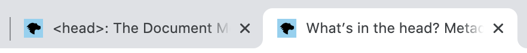
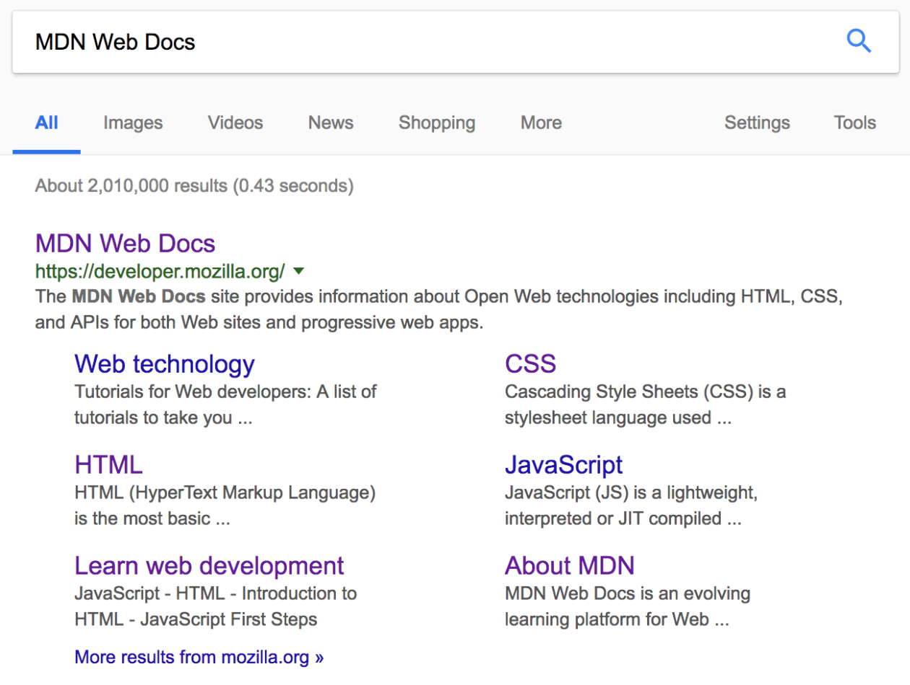

# DOCTYPE, `<head>` 태그, 검색엔진 최적화(Search Engine Optimization)

<br>

## DOCTYPE

DOCTYPE(DTD, Document Type Definition)은 마크업(Markup) 언어에서 문서의 형식(버전)을 지정합니다. 아래와 같이 HTML 문서의 가장 상단인 첫 줄에 작성합니다.

```html
<!DOCTYPE html>
<html>
	..
</html>
```

<br>

DOCTYPE은 HTML 문서의 버전 정보를 알려주는 역할을 합니다. 웹 브라우저가 HTML 문서를 렌더링하기 전에 어떤 버전의 HTML 문서인지 알려주어 해당 버전의 해석 방식으로 구조화되도록 합니다. HTML 버전에는 크게 1, 2, 3, 4, X-, 5 버전이 있으며, 현재는 5 버전이 표준입니다.

<br>

```html
<!-- HTML 5 -->
<!DOCTYPE html>

<!-- HTML 4 -->
<!DOCTYPE html PUBLIC "-//W3C//DTD HTML 4.01//EN" "http://www.w3.org/TR/html4/strict.dtd">

<!-- XHTML 1.0 -->
<!DOCTYPE html PUBLIC "-//W3C//DTD XHTML 1.0 Transitional//EN" "http://www.w3.org/TR/xhtml1/DTD/xhtml1-transitional.dtd">
```

<br>

> 작성한 HTML 문서가 웹 표준에 위배되지 않는지 검사할 수 있습니다. W3C에서 [Validator](https://validator.w3.org/)를 제공합니다.

<br>

## `<html>` 태그

`<html>` 태그는 HTML 문서의 전체 범위를 지정합니다. 웹 브라우저가 해석해야 하는 HTML 문서가 어디에서 시작하며, 어디에서 끝나는지 알려주는 역할을 합니다.

<br>

예를 들어, 아래와 같이 `<html>` 태그 밖에 있는 내용은 문서의 범위에 해당하지 않으므로 웹 브라우저가 렌더링하지 않습니다.

```html
<html>
	..
</html>

Hello.
```

<br>

### `lang` 속성

문서의 주요 언어를 설정할 수 있습니다(설정해야 합니다). `<html>` 태그의 `lang` 속성을 사용하세요.

```html
<html lang="en-US">
	..
</html>
```

<br>

> `lang` 속성의 값으로는 지정하고자 하는 언어(-국가)의 [ISO 639-1 코드](https://ko.wikipedia.org/wiki/ISO_639-1_%EC%BD%94%EB%93%9C_%EB%AA%A9%EB%A1%9D)를 지정하면 됩니다.

<br>

이는 검색엔진 최적화(Search Engine Optimization)와 웹 접근성(Web Accessibility) 측면에서 모두 도움이 됩니다. HTML 문서에 위와 같이(`lang="en-US"`) 언어 설정이 되어있으면, 검색엔진에 의해 "US 영어를 사용하는 페이지"로 인덱스 됩니다. 따라서 영어 검색어에 대한 검색 결과로 해당 페이지가 검색될 가능성이 높아집니다. 같은 이유로 한글 검색어에 대해서는 한글 언어가 설정된 페이지들이 우선적으로 검색됩니다.

한편, 사용자가 "six"라는 검색어를 사용한다고 상상해보세요. 이 단어는 영어에도 있지만 프랑스어에도 있는데요, 철자는 같지만 발음은 다르게 합니다. 시각 장애인은 스크린 리더(Screen Reader)를 이용해 웹 페이지를 읽는데요, 이때 페이지의 주요 언어가 설정되어 있어야 적합한 언어에 맞게 읽히겠죠.

> 참고로, 페이지의 주요 언어와 다른 언어를 혼용해서 사용하는 경우 아래와 같이 부분 지정이 가능합니다.

<br>

```html
<p>Japanese example: <span lang="ja">ご飯が熱い。</span>.</p>
```

<br>

## `<head>` 태그

`<head>` 태그는 해당 HTML 문서에 대한 정보를 작성하겠다고 선언하는 역할을 합니다. 따라서 `<head>` 태그 안에서 사용하는 모든 태그와 텍스트들은 해당 HTML 문서에 대한 정보(Metadata)를 담고 있습니다.

<br>

아래와 같이 사용합니다. `<title>` 태그는 해당 HTML 문서의 제목 정보를 담고 있습니다.

```html
<!DOCTYPE html>
<html>
	<head>
		<title>Document title</title>
	</head>
</html>
```

<br>

아래의 태그들은 `<head>` 태그 내에서 문서에 대한 정보, 외부 리소스 연결, CSS, 기준 URL을 작성할 때 사용합니다.

- `<title>`

- `<meta>`

- `<link>`

- `<style>`

- `<base>`

<br>

## `<title>` 태그

위에서 보았듯이 `<title>` 태그는 해당 HTML 문서의 제목 정보를 담고 있습니다. 이 정보는 브라우저에서 웹 페이지 탭에 노출됩니다.

<br>



<br>

위와 같은 웹페이지의 제목은 `What’s in the head? Metadata in HTML` 라는 것을 알 수 있습니다. 이는 `<head>` 태그 내에서 아래와 같이 마크업되었을 것입니다.

```html
<head>
	<title>What’s in the head? Metadata in HTML</title>
</head>
```

<br>

## `<meta>` 태그

HTML 문서(웹페이지)에 대한 정보를 검색엔진이나 브라우저에 제공합니다. `<title>` 태그와 같이 별도의 태그 문법을 갖고 있지 않은 기타 정보들(Metadata)이 `<meta>` 태그를 사용하여 저장됩니다. 웹페이지의 제작자, 내용, 키워드 등의 정보를 담고 있으며, 빈(Empty) 태그입니다.

<br>

아래와 같이 사용합니다.

```html
<!-- character encoding -->
<meta charset="utf-8" />

<!-- author -->
<meta name="author" content="Chris Mills" />

<!-- description -->
<meta
	name="description"
	content="The MDN Web Docs Learning Area aims to provide
complete beginners to the Web with all they need to know to get
started with developing web sites and applications."
/>
```

<br>

`<meta>` 태그의 속성에는 아래와 같은 것들이 있습니다.

- `charset`

- `http-equiv`

- `name`

- `content`

<br>

자세한 내용은 MDN의 [<meta>: The Document-level Metadata element](https://developer.mozilla.org/en-US/docs/Web/HTML/Element/meta)를 참고하세요.

<br>

## `<meta>` 태그의 속성들

### 1) `charset`

문자 인코딩(Character encoding) 방식을 지정합니다.

> [Character encodings for beginners](https://www.w3.org/International/questions/qa-what-is-encoding), [Character encoding](https://en.wikipedia.org/wiki/Character_encoding)

<br>

`<meta charset />`은 `<head>` 태그 내에서 가장 첫 줄에 작성하는 것이 좋습니다. 그래야 `<title>` 태그의 내용을 포함해 모든 글자의 인코딩에 관여할 수 있기 때문입니다. 예를 들어, 아래에서 `"문서의 제목"` 글자들은 그 위에서 지정한 Character Set에 따라 UTF-8 방식으로 인코딩 됩니다.

```html
<head>
	<meta charset="utf-8" />
	<title>문서의 제목</title>
</head>
```

<br>

> 대표적으로 한글 인코딩이 가능한 방식에는 `UTF-8`, `EUC-KR` 2 가지가 있습니다. 참고로, `EUC-KR` 방식은 완성형 한글만 인식하기 때문에 한글 깨짐 이슈가 있습니다. 따라서 최근에는 조합형 한글 인코딩을 지원하는 `UTF-8` 방식이 주로 사용됩니다.

<br>

### 2) `http-equiv`

아래 마크업은 해당 HTML 문서가 Internet Explorer 브라우저에서 렌더링될 때, 최신 버전(`edge`) 방식으로 렌더링 하라는 뜻입니다.

```html
<head>
	<meta http-equiv="X-UA-Compatible" content="IE=edge" />
</head>
```

<br>

### 3) `name`

검색엔진 등에 제공하기 위한 정보의 타입(Type)을 지정합니다.

- `author`, `description`, `keywords`, `viewport` 등

<br>

#### `name="viewport"`

아래는 뷰포트(Viewport) - 문서가 렌더링되어 보여지는 영역에 대한 정보를 작성한 것입니다. 뷰포트의 가로 너비(`width`) 값을 디바이스 가로 너비에 맞춘다는 뜻입니다.

```html
<meta name="viewport" content="width=device-width, initial-scale=1.0" />
```

<br>

### 4) `content`

`name`/`http-equiv` 속성에 대한 값을 지정합니다.

<br>

### 도태된 `<meta>` 태그의 속성들

`<meta>`의 많은 속성들이 더이상 사용되지 않습니다. 예를 들어, 아래와 같은 `keywords` 메타데이터는 이제 검색엔진에서 무시합니다.

> ```html
> <meta name="keywords" content="fill, in, your, keywords, here" />
> ```

원래 `keywords` 속성은 검색엔진에서 검색어와 해당 웹 페이지의 관련성을 결정하기 위해 고안되었지만, 이를 악용한 스팸 페이지들이 생겨남에 따라 더이상 사용되지 않게 되었습니다.

<br>

## `<link>` 태그

현재 문서와 외부 문서를 연결할 때 사용하는 태그입니다. HTML 외부에서 작성된 문서, 가령 CSS 파일이나 Favicon 이미지를 불러와 HTML 문서와 연결하기 위해 사용됩니다. 빈(Empty) 태그이며, 다음과 같은 속성들을 사용하여 외부 파일을 연결합니다.

- `rel` : 외부 리소스와의 관계 (필수)

  > `rel` 속성의 값으로 가능한 [목록](https://developer.mozilla.org/en-US/docs/Web/HTML/Link_types)

- `href` : 외부 리소스의 URL (절대/상대경로)

- `crossorigin` : 리소스를 가져올 때 [CORS](https://developer.mozilla.org/en-US/docs/Web/HTTP/CORS)를 사용해야 하는지
  > `anonymous` / `use-credentials`

<br>

자세한 내용은 [<link>: The External Resource Link element | MDN](https://developer.mozilla.org/en-US/docs/Web/HTML/Element/link)을 참고하세요.

<br>

### CSS

```html
<link rel="stylesheet" href="home.css" />
```

<br>

### Favicon

Favicon은 "Favorites icon"의 약어입니다. 브라우저 탭과 북마크 등에서 해당 페이지를 상징하는 아이콘으로 주로 사용되며, `<title>` 태그에서 지정한 문서의 제목과 함께 노출됩니다. Favicon 이미지를 문서에 연결할 때 아래와 같이 `<link>` 태그를 사용합니다.

```html
<link rel="shortcut icon" href="favicon.ico" type="image/x-icon" />
```

<br>

> 주의 : Favicon 이미지는 보통 `.ico` 포맷을 사용합니다. 대부분의 최신 브라우저에서 `.gif`, `.png` 등의 이미지 포맷을 지원하지만, IE6과 같은 아주 오래된 브라우저에서도 Favicon 이미지를 보여주고 싶다면 `.ico` 포맷을 사용하세요...

> 주의 : If your site uses a Content Security Policy (CSP) to enhance its security, the policy applies to the favicon. If you encounter problems with the favicon not loading, verify that the Content-Security-Policy header's img-src directive is not preventing access to it.

<br>

다양한 디바이스의 등장으로 현재는 아래와 같이 다양한 Favicon 타입들을 함께 고려해야 합니다.

```html
<!-- third-generation iPad with high-resolution Retina display: -->
<link
	rel="apple-touch-icon-precomposed"
	sizes="144x144"
	href="https://developer.cdn.mozilla.net/static/img/favicon144.a6e4162070f4.png"
/>
<!-- iPhone with high-resolution Retina display: -->
<link
	rel="apple-touch-icon-precomposed"
	sizes="114x114"
	href="https://developer.cdn.mozilla.net/static/img/favicon114.0e9fabd44f85.png"
/>
<!-- first- and second-generation iPad: -->
<link
	rel="apple-touch-icon-precomposed"
	sizes="72x72"
	href="https://developer.cdn.mozilla.net/static/img/favicon72.8ff9d87c82a0.png"
/>
<!-- non-Retina iPhone, iPod Touch, and Android 2.1+ devices: -->
<link
	rel="apple-touch-icon-precomposed"
	href="https://developer.cdn.mozilla.net/static/img/favicon57.a2490b9a2d76.png"
/>
<!-- basic favicon -->
<link
	rel="shortcut icon"
	href="https://developer.cdn.mozilla.net/static/img/favicon32.e02854fdcf73.png"
/>
```

<br>

## `<style>` 태그

`<style>` 태그 안에는 CSS를 작성할 수 있습니다. 문서에 대한 정보를 담고 있는 태그는 아니지만, 브라우저 렌더링 프로세스를 고려하여 `<head>` 태그 내에 작성합니다.

```html
<head>
	<style type="text/css">
		div {
			color: tomato;
		}
	</style>
</head>
```

<br>

### MIME Type

MIME(Multipurpose Internet Mail Extensions) Type, 쉽게 말해 미디어 타입(Media Type)은 문서, 파일, 바이트 정렬 등의 특성과 포맷을 나타내는 기준을 말합니다. 위의 `type` 속성 값으로 사용된 `text/css`도 MIME Type 기준에 따라 작성된 것입니다.

<br>

참고로 HTML 5 부터는 위의 `type="text/css"`가 기본값이므로 생략합니다. 마찬가지로 `<link>` 태그를 이용하여 외부 CSS 파일을 연결할 때도, 외부 파일의 타입을 자동으로 검사하기 때문에 따로 명시하지 않습니다.

> 현대적인 웹 문서에서 `type` 속성을 포함할 이유는 거의 존재하지 않습니다.

<br>

## `<base>` 태그

문서 내의 모든 상대 경로(URL)가 사용할 기준 URL을 지정합니다. 문서에는 하나의 `<base>` 요소만 존재할 수 있습니다. 예를 들어, 아래의 경우 `<link>` 태그는 `<base>` 태그에 지정된 기준 경로를 참조하여, `./css/main.css` 경로에서 해당 파일을 찾습니다.

```html
<head>
	<base href="./css/" />
	<link rel="stylesheet" href="main.css" />
</head>
```

<br>

이렇게도 사용할 수 있어요.

```html
<head>
	<base href="./image/" />
</head>
<body>
	
</body>
```

<br>

## 검색엔진 최적화(Search Engine Optimization)

[검색엔진 최적화(SEO)](https://developer.mozilla.org/en-US/docs/Glossary/SEO)를 달성하려면 `<head>` 태그 내에서 문서에 대한 정보를 담고있는 태그들을 잘 활용해야 합니다.

<br>

예를 들어, `<title>` 태그와 `<meta>` 태그의 `description` 속성은 검색엔진 최적화에 직접적으로 기여합니다. 다음은 [Mozilla Developer Network](https://developer.mozilla.org/en-US/) 사이트 첫 페이지의 `<head>` 태그 내부의 일부 마크업 입니다.

```html
<title>MDN Web Docs</title>
<meta
	name="description"
	content="The MDN Web Docs site
  provides information about Open Web technologies
  including HTML, CSS, and APIs for both Web sites and
  progressive web apps."
/>
```

<br>

아래는 구글 검색결과 입니다. `<title>` 태그와 `<meta>` 태그의 `description` 속성 값으로 담겨있는 정보가 검색 결과에 그대로 노출되네요.



<br>

### Sitelinks

위의 구글 검색결과를 보면, 우리가 찾고자 했던 MDN Web Docs 사이트의 첫 페이지 외에도 관련된 서브 페이지들이 함께 검색되어 노출됩니다. 이런 서브 페이지들을 Sitelinks 라고 부릅니다. Sitelinks는 [Google Search Console](https://search.google.com/search-console/welcome?hl=ko&utm_source=wmx&utm_medium=deprecation-pane&utm_content=home)에서 설정할 수 있습니다.

<br>

---

### References

- [Document type declaration](https://en.wikipedia.org/wiki/Document_type_declaration)
- [What’s in the head? Metadata in HTML | MDN](https://developer.mozilla.org/en-US/docs/Learn/HTML/Introduction_to_HTML/The_head_metadata_in_HTML)
- [\<head\>: The Document Metadata (Header) element | MDN](https://developer.mozilla.org/en-US/docs/Web/HTML/Element/head)
- [\<base\>: The Document Base URL element | MDN](https://developer.mozilla.org/en-US/docs/Web/HTML/Element/base)
- [\<meta\>: The Document-level Metadata element | MDN](https://developer.mozilla.org/en-US/docs/Web/HTML/Element/meta)
- [Sitelinks | Google Search Console Help](https://support.google.com/webmasters/answer/47334?hl=en)
- [What are sitelinks and how can I get them?](https://www.searchenginewatch.com/2017/11/30/what-are-sitelinks-and-how-can-i-get-them/)
- [입문자에게 추천하는 HTML, CSS 첫걸음 | HEROPY Tech](https://heropy.blog/2019/04/24/html-css-starter/)
