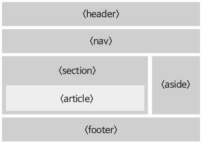
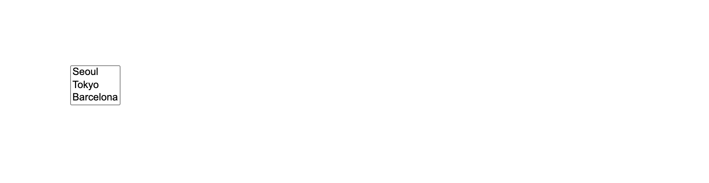
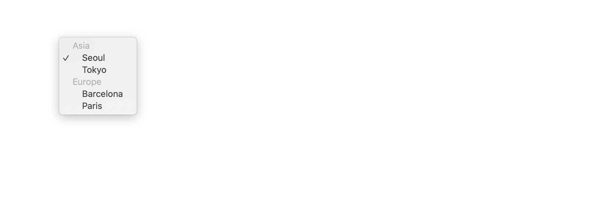
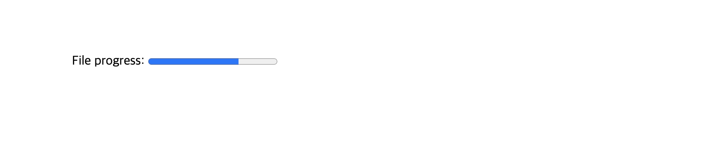

# HTML tags - stay semantic

> HTML 태그(Tag)에 대한 설명과 시멘틱 마크업(Semantic Markup)을 위한 팁들을 태그(Tag) 별로 나열하는 문서입니다.

<br>

## HTML elements reference

### Content sectioning

다음은 콘텐츠를 구분할 때 사용하는 태그입니다.

- `<h1>`-`<h6>`

- `<hgroup>`

  > Multi-level heading. It groups a set of `<h1>`–`<h6>` elements.

- `<header>`

- `<footer>`

- `<main>`

- `<article>`

- `<section>`

- `<aside>`

- `<nav>`

- `<address>`

<br>

#### 예시

```html
<body>
	<header>
		<nav>
			<ul>
				<li>Menu1</li>
				<li>Menu2</li>
				<li>Menu3</li>
			</ul>
		</nav>
	</header>

	<main role="main">
		<section>
			<h1>Section</h1>
			<article>
				<h2>Article1</h2>
				<p>..</p>
			</article>
			<article>
				<h2>Article2</h2>
				<p>..</p>
			</article>
		</section>

		<aside>Aside</aside>
	</main>

	<footer>
		<address>
			<a href="mailto:abc@gmail.com">abc@gmail.com</a>
			<a href="tel:+821000000000">010-0000-0000</a>
		</address>
	</footer>
</body>
```

<br>

### Text content

문자 콘텐츠를 나타내는 태그입니다.

- `<div>`

- `<ul>`/`<ol>`/`<li>`

- `<dl>`/`<dt>`/`<dd>`

- `<p>`

- `<hr />`

- `<pre>`

- `<blockquote>`

<br>

### Inline text semantics

문자(텍스트)의 의미, 구조, 스타일 등을 정의하는 태그입니다.

- `<a>`

- `<abbr>`

- `<b>`

- `<mark>`

- `<em>`

- `<strong>`

- `<i>`

- `<dfn>`

- `<cite>`

- `<q>`

- `<u>`

- `<code>`

- `<kbd>`

- `<sup>`, `<sub>`

- `<time>`

- `<span>`

- `<br />`

<br>

### Demarcating edits

텍스트의 특정 부분이 수정되었음을 나타내는 태그들입니다.

- `<del>`

- `<ins>`

<br>

### Image and multimedia

이미지, 오디오, 비디오 등 멀티미디어 리소스를 지원하는 태그들입니다.

- ``

- `<audio>`

- `<video>`

- `<map>`

- `<area>`

- `<track>`

> 멀티미디어 리소스가 보여질 영역을 나타내기 위해 `<figure>`/`<figcaption>` 태그를 사용합니다.

<br>

이 태그들에 대한 설명은 [여기에](https://github.com/estellechoi/TIL/blob/master/html/multimedia.md) 별도로 정리했습니다.

<br>

### Embedded content

내장 콘텐츠를 삽입하는데 사용하는 태그들입니다.

- `<iframe>`

<br>

### Scripting

동적 콘텐츠를 제공하기 위해 스크립트 언어(JavaScript)의 동작을 지원하는 태그들입니다.

- `<script>`

- `<noscript>`

- `<canvas>`

<br>

### Table content

테이블 데이터를 표시하기 위한 태그들입니다.

- `<table>`/`<caption>`/`<tr>`

- `<th>`/`<td>`

- `<colgroup>`/`<col>`

- `<thead>`/`<tbody>`/`<tfoot>`

<br>

이 태그들에 대한 설명은 [여가에](./table.md) 별도로 정리했습니다.

<br>

### Forms

웹 서버에 데이터를 제출하기 위해 사용하는 양식(Form)을 구성하는 태그들입니다.

- `<form>`

- `<input />`

- `<button>`

- `<label>`

- `<select>`

- `<datalist>`

- `<option>`/`<optgroup>`

- `<textarea>`

- `<output>`

- `<progress>`

- `<fieldset>`/`<legend>`

<br>

## `<h1>` - `<h6>`

> 웹 브라우저가 제목 정보를 사용해 자동으로 문서 콘텐츠의 표를 만드는 등의 작업을 수행할 수 있습니다.

<br>

- 글씨 크기를 크게 만들기 위해 `<h1>`과 같은 제목 태그를 사용하지 마세요. 대신 CSS의 `font-size` 속성을 사용하세요.

- 제목 단계를 건너뛰는 것을 피하세요. 항상 `<h1>`으로 시작해서, `<h2>`,.. 순차적으로 사용하세요.

- 페이지 당 하나의 `<h1>` 태그만 사용하세요. 여러 개를 써도 오류는 나지 않겠지만, `<h1>` 태그는 하나만 사용하는 것이 모범적입니다. 논리적으로 생각했을 때도, `<h1>`은 가장 중요한 제목이므로 전체 페이지의 목적을 설명하는데 사용해야 합니다. 두 개의 제목을 가진 책이나, 여러 개의 이름을 가진 영화는 볼 수 없죠! 또한 스크린 리더(Screen Reader) 사용자와 검색엔진 최적화(SEO)에도 더 적합합니다.

<br>

## `<header>`

> 제목, 로고, 검색 폼, 작성자 이름 등의 요소

<br>

## `<footer>`

> 가장 가까운 구획 콘텐츠의 푸터. 일반적으로 구획의 작성자, 저작권 정보, 관련 문서 등의 내용을 담습니다.

<br>

## `<main>`

> IE 지원 X

> 주요 콘텐츠를 나타냅니다. 주요 콘텐츠란 문서의 핵심 주제, 앱의 핵심 기능에 직접적으로 연결되거나 기능을 확장하는 콘텐츠입니다.

<br>

- (`hidden` 속성 없이는) 문서 전체에 하나의 `<main>` 요소만 존재해야 합니다.

- 해당 문서만의 유일한 내용을 담아야 합니다. 사이드바, 탐색 링크, 저작권 정보, 사이트 로고, 검색 Form 등 여러 문서에 걸쳐 반복되는 콘텐츠는 포함해선 안됩니다. 그러나 검색 폼이 페이지의 주요 기능이라면 예외로 둘 수 있습니다.

- 개요에 영향을 주지 않습니다. `<body>` 등의 요소나 `<h2>`와 같은 제목 요소와 달리, `<main>`은 페이지의 개념적 구조를 바꾸지 않으며 온전히 정보 제공용입니다.

<br>

### 브라우저 호환성 이슈

IE 11 이하의 브라우저를 지원해야 한다면 `main` [role](https://developer.mozilla.org/en-US/docs/Web/Accessibility/ARIA/ARIA_Techniques#Landmark_roles) [ARIA](https://developer.mozilla.org/en-US/docs/Web/Accessibility/ARIA/ARIA_Techniques)를 사용하세요.

이렇게요.

```html
<main role="main">
	...
</main>
```

<br>

## `<article>`

> 문서, 페이지, 애플리케이션, 또는 사이트 안에서 독립적으로 구분해 배포하거나 재사용할 수 있는 구획을 나타냅니다. (게시판, 블로그 글, 매거진, 뉴스 기사 등)

> 독립성, 재사용성 !

<br>

- 예를 들어, 사용자가 스크롤하면 계속해서 다음 글을 보여주는 블로그의 경우, 각각의 글이 `<article>` 요소가 되며, 그 안에는 또 여러 개의 `<section>`이 존재할 수 있습니다.

- 주로 제목 요소(`<h1>` ~ `<h6>`)를 포함하여 각각의 `<article>`을 식별합니다.

- `<article>` 요소 안에 `<article>` 요소를 중첩할 수 있습니다.

<br>

## `<section>`

> 문서의 독립적인 구획을 나타내며, 더 적합한 의미를 가진 요소가 없을 때 사용합니다.

<br>

- 요소의 콘텐츠를 외부와 구분하여 단독으로 묶는 것이 나아보인다면 `<article>` 요소가 더 좋은 선택일 수 있습니다.

- `<section>` 요소를 일반 컨테이너로 사용하지 마세요. 특히 단순한 스타일링이 목적이라면 `<div>` 요소를 사용해야 합니다. 대개, 문서 요약에 해당 구획이 논리적으로 나타나야 하면 `<section>`이 좋은 선택입니다.

  > 아무런 의미가 없는 `<div>` 요소와 달리, `<section>` 요소는 의미를 가진다는 점에 주의하세요.

- 주로 제목 요소(`<h1>` ~ `<h6>`)를 포함하여 각각의 `<section>`을 식별합니다. (`<article>` 요소와 마찬가지로)

<br>

### 예시

```html
<h1>How to Fish</h1>
<section>
	<h2>Introduction</h2>
	<p>People have been catching fish for food since before recorded history…</p>
</section>
```

<br>

## `<aside>`

> 문서의 주요 내용과 직접적인 관련이 없는 부분을 나타냅니다. (사이드바 혹은 콜아웃 박스 - 광고, 배너 영역에 많이 사용합니다.)



<br>

## `<nav>`

> 현재 페이지 내부, 또는 다른 페이지로의 링크를 보여주는 영역입니다. 보통 메뉴, 목차, 색인 등에 사용합니다.

> (Navigation)

<br>

- 문서의 모든 링크가 `<nav>` 요소 안에 있을 필요는 없습니다. `<nav>` 요소는 주요 탐색 링크 블록을 위한 요소입니다.

  > 대개 `<footer>` 요소가 `<nav>`에 들어가지 않아도 되는 링크를 포함합니다.

- 스크린 리더(Screen Reader)는 최초 렌더링에서 탐색 전용 콘텐츠를 제외할지 결정할 때 `<nav>`를 참고합니다.

<br>

### 예시

```html
<nav>
	<ul>
		<li>Home</li>
		<li>About</li>
		<li>Contact</li>
	</ul>
</nav>
```

<br>

## `<address>`

> 사람, 단체, 조직 등에 대한 연락처 정보를 나타냅니다.

<br>

- 연락처 외의 정보(출판일 등)를 담아서는 안됩니다.

- `<body>`, `<article>`, `<footer>` 등에서 `<address>` 요소를 포함하여 사용합니다.

<br>

### 예시

```html
<address>
	<a href="mailto:jim@rock.com">jim@rock.com</a><br />
	<a href="tel:+13115552368">(311) 555-2368</a>
</address>
```

> - `<a href="mailto:...">` : 이 요소를 클릭하면, 각 플랫폼에서 지원하는 메일 쓰기 페이지/앱으로 이동합니다.

> - `<a href="tel:...">` : 이 요소를 클릭하면, 각 플랫폼에서 지원하는 전화 앱으로 이동합니다.

<br>

## `<div>`

> 아무 의미가 없는 영역을 나타냅니다. 스타일링 목적으로 사용합니다.

> (Division)

<br>

## `<ul>`/`<ol>`/`<li>`

> 순서가 있는 목록(`<ol>`) / 순서가 없는 목록(`<ul>`)에 사용합니다. `<li>` 태그는 목록의 각 아이템입니다.

<br>

- 항목의 순서를 바꿨을 때 의미도 바뀐다면 `<ol>`을 사용하세요.

  > 예를 들어, 단계별 요리법, 내비게이션, 영양정보에서 비율의 내림차순으로 정렬한 원재료 목록 등에서요.

- 목록의 넘버링이 (순서로서의 의미를 가지기 보다) 법/기술 문서 등에서 단순한 인덱스의 역할만 한다면, `<ol>` 태그보다는 CSS의 `list-style-type` 속성을 사용하세요.

<br>

### `<ol>` 태그의 속성

- `type` : 넘버링 타입 ()

  - `a` : lowercase letters
  - `A` : uppercase letters
  - `i` : lowercase Roman numerals
  - `I` : uppercase Roman numerals
  - `1` : numbers (default)

    > `<li>` 태그에 별도로 `type` 속성을 명시하지 않으면 `<ol>` 태그의 `type` 속성이 적용됨

- `reversed` : 역순 정렬 (Boolean)

- `start` : 아이템에 넘버링을 할 때 첫 번째 순서를 나타내는 숫자
  > `type` 값이 `A`와 같이 문자이더라도, `start` 속성 값은 `3`과 같이 숫자만 지정할 수 있습니다.

<br>

#### 예시

```html
<ol type="1" reversed>
	<li>Mix flour, baking powder, sugar, and salt.</li>
	<li>In another bowl, mix eggs, milk, and oil.</li>
	<li>Stir both mixtures together.</li>
	<li>Fill muffin tray 3/4 full.</li>
	<li>Bake for 20 minutes.</li>
</ol>
```

<br>

### `<li>` 태그의 속성

- `value` : 해당 아이템을 시작으로 넘버링하는데 사용합니다.

```html
<ol>
	<li value="1">Mix flour, baking powder, sugar, and salt.</li>
	<li>In another bowl, mix eggs, milk, and oil.</li>
	<li>Stir both mixtures together.</li>
	<li>Fill muffin tray 3/4 full.</li>
	<li>Bake for 20 minutes.</li>
</ol>
```

<br>

## `<dl>`/`<dt>`/`<dd>`

> `<dl>` 태그는 설명 그룹의 목록을 나타냅니다. 설명 그룹은 용어(`<dt>`) + 정의(`<dd>`)를 한 그룹으로 합니다. 주로 용어사전 구현이나 메타데이터(키-값 쌍 목록)를 표시하는데 사용합니다.

> (Definition Term / Definition Details / Description List)

<br>

- 페이지에서 들여쓰기를 하기 위한 목적으로 `<dl>` (또는`<ul>`) 요소를 사용하지 마세요. 원래 목적을 흐립니다.

- 용어의 들여쓰기를 수정하려면 CSS의 `margin` 속성을 사용하세요.

<br>

### Styling

용어 그룹을 묶어서 스타일링할 때 `<div>` 태그를 사용할 수 있습니다.

<br>

```html
<dl>
	<div>
		<dt>Beast of Bodmin</dt>
		<dd>A large feline inhabiting Bodmin Moor.</dd>
	</div>

	<div>
		<dt>Morgawr</dt>
		<dd>A sea serpent.</dd>
	</div>

	<div>
		<dt>Owlman</dt>
		<dd>A giant owl-like creature.</dd>
	</div>
</dl>
```

<br>

### 웹 접근성

[각각의 스크린 리더는 `<dl>`을 다르게 표현합니다](https://cdpn.io/aardrian/debug/NzGaKP). iOS VoiceOver 등 일부 스크린 리더는 `<dl>` 요소를 목록으로 표현하지 않습니다. 따라서, 각 아이템의 콘텐츠는 리스트 그룹 내 다른 항목과의 관계를 표현할 수 있는 방식으로 작성해야 합니다.

<br>

웹 접근성을 고려하여 `<ul>`과 `<dfn>` 태그를 사용할 수 있겠네요.

> `<dfn>`은 용어 하나를 정의하는 태그입니다.

```html
<ul>
	<li>
		<dfn>Beast of Bodmin</dfn>
		<p>A large feline inhabiting Bodmin Moor.</p>
	</li>

	<li>
		<dfn>Morgawr</dfn>
		<p>A sea serpent.</p>
	</li>

	<li>
		<dfn>Owlman</dfn>
		<p>A giant owl-like creature.</p>
	</li>
</ul>
```

<br>

## `<p>`

> 하나의 문단을 나타냅니다. HTML에서 문단은 이미지, 입력 폼 등 서로 관련있는 콘텐츠 무엇이나 될 수 있습니다.

<br>

- 콘텐츠를 문단으로 나누면 페이지의 접근성을 높입니다. 스크린 리더 등의 보조 기기는 `<p>` 태그를 사용하여 다음 문단으로 넘어갈 수 있는 단축키 등을 제공합니다.

- 문단 사이에 여백을 추가하기 위해 빈 `<p>` 요소를 사용하지 마세요. 스크린 리더 사용자가 혼란스러울 수 있습니다. 스크린 리더가 문단의 존재는 알려주지만, 읽을 문단의 내용이 없기 때문입니다.

<br>

### 닫는 태그 생략

자신의 닫는 태그(`</p>`) 이전에 다른 블록 레벨 태그가 해석되면 자동으로 닫힙니다.

> 닫는 태그는 `<p>` 요소의 바로 뒤에 `<address>`, `<article>`, `<aside>`, `<blockquote>`, `<div>`, `<dl>`, `<fieldset>`, `<footer>`, `<form>`, `<h1>`-`<h6>`, `<header>`, `<hr>`, `<menu>`, `<nav>`, `<ol>`, `<pre>`, `<section>`, `<table>`, `<ul>`, `<p>` 요소가 위치하는 경우 생략할 수 있습니다. 또는 부모 태그의 콘텐츠가 더 존재하지 않고 부모가 요소가 `<a>`가 아닐 때 생략할 수 있습니다.

<br>

## `<hr />`

> 문단을 분리합니다. 이야기 장면 전환, 구획 내 주제 변경 등 문단 레벨에서 주제의 분리를 나타냅니다.

> (Horizontal Rule)

<br>

- 아무 의미없이 스타일링을 위해 가로줄을 그리는 목적으로 사용하지 마세요.
  > `<hr />`은 브라우저에서 가로줄로 그려지는 시각적 기능이 있지만, 시각적 표현에 그치지 않고 의미를 가지게 되었습니다.

<br>

### Styling

`<hr />` 요소는 사실 단순한 가로줄이 아닌, 납작한 박스 형태입니다. 기본적으로 모든 요소는 사각형의 박스 형태를 하고 있죠. 따라서 `border` 속성 값을 아래와 같이 작성하면, 해당 `<hr />` 요소가 그려내는 가로줄의 두께는 `2px`이 됩니다.

```css
hr {
	border: 1px solid tomato;
}
```

<br>

가로줄을 숨기거나 꾸미려면 브라우저마다 제각각 적용된 `border` 스타일을 제거하세요.(`border: none`) 이렇게 하는 것이 정확합니다.

```css
hr {
	border: none;
	border-top: 1px solid tomato;
}
```

위와 같이 하면 `<hr />` 가로줄의 두께는 `1px` 입니다.

<br>

## `<pre>`

> 서식이 미리 지정된 텍스트입니다. HTML에 작성한 내용 그대로 표현하는데요, (Enter, Space 키로 만드는) 공백문자를 그대로 유지합니다. 내부에 [구문 콘텐츠](https://developer.mozilla.org/ko/docs/Web/Guide/HTML/Content_categories#%EA%B5%AC%EB%AC%B8_%EC%BD%98%ED%85%90%EC%B8%A0) 태그만 사용할 수 있습니다.

> 모든 글자의 너비가 같은 고정길이 글꼴([Monospaced Font](https://en.wikipedia.org/wiki/Monospaced_font))로 표현됩니다.

> (Preformatted Text)

<br>

- `<pre>` 요소로 만든 이미지나 도표에 대한 대체 설명을 지정하는 것이 중요합니다.

<br>

### 예시

```html
<pre>
  L          TE
    A       A
      C    V
       R A
       DOU
       LOU
      REUSE
      QUE TU
      PORTES
    ET QUI T'
    ORNE O CI
     VILISÉ
    OTE-  TU VEUX
     LA    BIEN
    SI      RESPI
            RER       - Apollinaire
</pre>
```

<br>

### 웹 접근성

```html
<figure role="img" aria-labelledby="cow-caption">
	<pre>
  _______________________
< 나는 이 분야의 전문가다. >
  -----------------------
         \   ^__^ 
          \  (oo)\_______
             (__)\       )\/\
                 ||----w |
                 ||     ||
  </pre>
	<figcaption id="cow-caption">
		소 한 마리가 "나는 이 분야의 전문가다"라고 말하고 있습니다. 소는 미리 서식을
		적용한 텍스트로 그려져있습니다.
	</figcaption>
</figure>
```

위의 예시에서는 `<figure>`, `<figcaption>` 태그, `id` 속성, ARIA `role`, `aria-labelledby` 속성을 조합하여 사용했습니다. `<pre>` 요소를 마치 이미지처럼 표현하면서 `<figcaption>` 요소를 사용하여 대체 설명을 제공하고 있네요.

<br>

## `<blockquote>`

> 인용문에 사용합니다. 주로 들여쓰기를 한 것으로 그려집니다.

> (Block Quotation)

<br>

- 별도의 블록을 쓰지 않아도 될 짧은 인용문은 `<q>` 요소를 사용하세요.

- 인용문의 들여쓰기를 바꾸려면 CSS의 `margin-left`/`margin-right`를 사용하세요.

<br>

### 속성

- `cite` : 인용문의 출처 URL

<br>

### 예시

```html
<blockquote cite="https://www.huxley.net/bnw/four.html">
	<p>
		Words can be like X-rays, if you use them properly—they’ll go through
		anything. You read and you’re pierced.
	</p>
	<footer>—Aldous Huxley, <cite>Brave New World</cite></footer>
</blockquote>
```

<br>

## `<a>`

> 다른 페이지, 같은 페이지 위치(`#id`), 파일, 이메일 주소, 전화번호 등 다른 URL에 접근할 수 있는 하이퍼링크를 제공합니다.

> (Anchor)

<br>

- 앵커 태그의 `href` 값을 `#`, `javascript:void(0)` 등으로 지정해서 가짜 버튼을 만드는 방식으로 남용하지 마세요.

  > 이런 가짜 `href` 값은 링크를 복사/드래그할 때, 링크를 새 탭/창에서 열 때, 즐겨찾기에 추가할 때, JavaScript를 불러오는 중일 때, 오류가 발생했을 때, JavaScript를 비활성화했을 때 예측하지 못한 동작을 하게 만듭니다. 또한, 스크린 리더에도 잘못된 의미를 전달합니다.

- `<a> .. </a>` 안의 콘텐츠는 맥락에서 벗어나더라도 링크가 향하는 곳을 <b>설명해야 합니다</b>.

  > 접근성 보조 기기는 페이지 안의 모든 링크들을 나열하는 단축키를 제공합니다.

  > <b>Not good</b>
  >
  > ```html
  > 저희 제품을 더 알아보시려면 <a href="/products">여기</a>를 클릭하세요.
  > ```
  >
  > <b>Good</b>
  >
  > ```html
  > 저희의 <a href="/products">제품을 더 알아보세요</a>.
  > ```

<br>

### 속성

- `download` : 링크로 이동하지 않고 해당 리소스를 다운로드하는 용도로 사용할 때 선언 (Boolean)

- `rel` : `prev`/`next`/`license` 등

- `target` : 연결된 URL을 표시할 대상(타겟) - 브라우저 탭, 창, `<iframe>`의 이름 등
  - `_self` : 현재 탭/창 (기본값)
  - `_blank` : 새 탭/창

<br>

### 보안

- `target="_blank"`를 `rel="noreferrer"`/`rel="noopener"` 없이 사용하면 보안상 위험합니다. 웹사이트가 `window.opener` API 악용 공격에 취약해집니다.

  > [Referer header: privacy and security concerns](https://developer.mozilla.org/ko/docs/Web/Security/Referer_header:_privacy_and_security_concerns)

  > [Target="\_blank" - the most underestimated vulnerability ever](https://www.jitbit.com/alexblog/256-targetblank---the-most-underestimated-vulnerability-ever/)

<br>

## `<abbr>`

> 약어

> `title` (선택)속성을 사용하면 약어의 전체 설명을 제공할 수 있습니다. 브라우저에서는 대개 마우스 커서를 올렸을 때 나타나는 툴팁(Tooltip)으로 표현됩니다.

> (Abbreviation)

<br>

- `title` 속성 값은 전체 설명만을 작성하며, 다른건 포함할 수 없습니다.

- `title` 속성은 약어에 대한 설명/확장 형태를 사람이 읽을 수 있는 형태로 나타내야 합니다.

- 설명 없이 단순히 해당 글자가 준말임을 나타내기만 하려면 `<abbr>` 태그를 속성 없이 사용하세요.

<br>

### Styling

```css
abbr {
	font-variant: all-small-caps;
}
```

<br>

### 예시

```html
<abbr title="Cascading Style Sheets">CSS</abbr>
```

<br>

## `<b>`

> 독자의 주의를 끌기 위해 사용합니다.

> (Bring Attention)

<br>

- 특별한 중요성을 가지고 있지는 않지만 주의를 끌고싶은 부분에 사용하세요.

  > 다른 태그(`<strong>`, `<em>`, `<mark>` 등)이 적합하지 않은 경우 마지막 방법으로 사용하세요.

- 제목을 만들기 위해 `<b>` 태그를 사용하지 마세요. (제목 태그는 `<h1>`-`<h6>`)

- 단순히 굵은 글씨가 필요하다면 CSS의 `font-weight="bold"`를 사용하세요.

<br>

## `<mark>`

> 글자를 하이라이트 표시합니다. (<mark>형광펜 효과</mark>)

<br>

- 시각적인 목적만 있다면 `<span>` 태그와 CSS를 대신 사용해야 합니다.

- 인용문(`<q>`, `<blockquote>`) 내에서 사용할 수 있습니다.

- 또는 문서 콘텐츠에서 사용자의 현재 행동과 관련 있는 부분을 나타낼 때 사용하세요.

<br>

## `<em>`

> 텍스트의 강세, 주위 텍스트에 비해 강조된 부분을 나타냅니다. (`<em>` 요소를 중첩하면 더 큰 강세)

> 기울임꼴(<i>italic</i>)로 표시됩니다.

> (Emphasis)

<br>

- 문장의 의미에 영향을 미칠 수 있습니다.

  > (I <em>love</em> carrots VS I love <em>carrots</em>)

- 단순히 기울임꼴이 필요해서 `<em>`을 사용하면 안됩니다. 스크린 리더에서 구두 강조로 발음됩니다.

  > 스타일링은 CSS `font-style`

- 저작물(책, 연극, 음악 등등)의 제목은 `<cite>` 태그를 사용하세요.

- 다른 언어의 단어 등 주변과 다른 톤을 가진 텍스트에는 `<i>`를 사용하세요. (`<em>`은 콘텐츠를 강조합니다.)

- 주변보다 훨씬 중요한 텍스트는 `<strong>` 태그로 강조하면 됩니다.

<br>

## `<strong>`

> 중대하거나 긴급한 콘텐츠를 나타냅니다.

> (Strong importance)

<br>

- 단순히 굵은 글씨가 필요해서 `<strong>` 태그를 사용하면 안됩니다. 스타일은 CSS로..

<br>

## `<i>`

> 텍스트에서 어떤 이유로 주위와 구분해야 하는 부분, 주변과 톤이 다른 부분에 사용합니다. (기술 용어, 외국어 구절, 등장인물의 생각, 아이콘 등)

> 기울임꼴(<i>italic</i>)로 표시됩니다.

<br>

- 단순히 기울임꼴을 적용하기 위한 용도로 사용해서는 안됩니다.

- 강조하려는 텍스트가 다른 요소에 더 적합하지 않은지 고려하세요.
  - `<em>` 태그는 강세를 나타냅니다.
  - `<strong>` 태그는 보다 강한 강조를 나타냅니다.
  - `<mark>` 태그는 관련성을 나타냅니다.
  - `<cite>` 태그는 책, 공연, 음악 등 저작물의 이름을 나타냅니다.
  - `<dfn>` 태그는 정의 대상인 용어를 나타냅니다.

<br>

## `<dfn>`

> 현재 맥락이나 문장에서 정의하고 있는 용어를 나타냅니다.

<br>

## `<cite>`

> 저작물의 출처를 표기할 때 사용하며, 제목을 반드시 포함해야 합니다.

```html
<p>More information can be found in <cite>[ISO-0000]</cite>.</p>
```

<br>

- W3C 명세는 `<cite>` 요소로 저작물의 출처를 표기할 때 저작자도 표기할 수 있음을 명시하고 있습니다. 그러나 정반대로, WHATWG 명세는 사람 이름을 어떤 상황에서도 절대 포함하지 말아야 한다고 적혀있다는 점을 알아두는 것이 좋습니다.

<br>

## `<q>`

> 짦은 인용문

> (Quotation)

<br>

- 긴 인용문을 작성할 때는 `<blockquote>` 태그를 사용하여 인용문 블록을 형성하세요.

<br>

## `<u>`

> 주석(Non-textual annotation)을 가지고 있음을 나타냅니다.

> (Unarticulated Annotation)

<br>

- `<u>` 태그를 사용해 밑줄만 추가하거나, 책 제목 등을 강조해서는 안됩니다.

  > 단순히 밑줄을 위해서는 CSS의 `text-decoration="underline"`을 사용하세요.

- 유효한 사용처는 철자 오류 강조, [중국어의 고유명사 표시](https://en.wikipedia.org/wiki/Proper_name_mark) 등이 있습니다.

<br>

### `<ruby>` for Text annotation

예시

```html
<ruby> 明日 <rp>(</rp><rt>Ashita</rt><rp>)</rp> </ruby>
```


<br>

## `<code>`

> 짧은 코드 조각을 나타냅니다.

> Monospaced Font

<br>

## `<kbd>`

> 키보드/음성 입력 등 임의의 장치를 사용한 사용자의 입력 부분을 나타냅니다.

> (Keyboard Input)

```html
<p>
	Please press <kbd>Ctrl</kbd> + <kbd>Shift</kbd> + <kbd>R</kbd> to re-render an
	MDN page.
</p>
```

<br>

- CSS를 사용해서 키보드 형태의 스타일링을 통해 명확하게 바꿀 수 있습니다.

<br>

## `<sup>`, `<sub>`

> 위 첨자(`<sup>`) / 아래 첨자(`<sub>`)

> (Superscripted text, Subscripted text)

```html
X<sup>4</sup> + Y<sup>2</sup>, H<sub>2</sub>O
```

<br>

## `<time>`

> IE 지원 X

> 시간의 특정 지점 또는 구간을 나타냅니다. `datetime` 속성을 지정하면 적절한 검색 결과, 알림 같은 특정 기능을 구현할 때 사용할 수 있습니다.

```html
<time datetime="2018-07-07">July 7</time>

<time datetime="20:00">20:00</time>

<time datetime="PT2H30M">2h 30m</time>
```

<br>

- [유효한 `datetime` 값](https://developer.mozilla.org/ko/docs/Web/HTML/Element/time#%EC%9C%A0%ED%9A%A8%ED%95%9C%20datetime%20%EA%B0%92)을 사용하세요.

<br>

## `<span>`

> 아무것도 나타내지 않습니다.

<br>

- 적절한 의미를 가진 다른 요소가 없을 때에만 사용해야 합니다.

<br>

## `<br />`

> `<br />` 요소는 텍스트 블록에서 줄을 바꾼다는 하나의 명확한 목적만 가지고 있습니다.

> (Break)

<br>

- 문단 사이에 여백을 두기 위한 용도로 `<br />`을 사용하지 마세요.

- `<br />` 요소에 CSS `margin`을 적용하면 줄 간격을 늘릴 수 있겠지만 좋은 방법은 아닙니다. 줄 간격은 `line-height` 속성을 사용하세요.

- 웹 접근성을 위해서는 `<br />` 대신 `<p>` 요소와 함께 CSS `margin` 속성 등을 조합해 간격을 조절하세요.

<br>

## `<del>`

> 삭제된(변경된) 텍스트

<br>

## `<ins>`

> 새로 추가된(변경된) 텍스트

<br>

## ``

> 문서에 이미지를 삽입하는 태그입니다.

<br>

- `alt` 속성에 대체 텍스트를 제공해야 합니다.

<br>

## `<audio>`

> 문서에 소리 콘텐츠를 포함할 때 사용합니다.

<br>

## `<video>`

> 비디오 플레이백을 지원하는 미디어 플레이어를 문서에 삽입합니다.

<br>

- 오디오 콘텐츠를 제공하려면 `<audio>` 태그를 사용하세요. 사용자 경험에 더 적합합니다.

<br>

## `<figure>`/`<figcaption>`

> `<figure>` : 이미지나 삽화, 도표 등의 영역을 지정합니다.

> `<figcaption>` : `<figure>` 요소 내에서 사용하며, 이미지 등의 멀티미디어에 대한 설명을 작성합니다.

<br>

## `<iframe>`

> 현재 문서 안에 다른 HTML 페이지를 삽입합니다. (중첩 [브라우징 맥락](https://developer.mozilla.org/en-US/docs/Glossary/Browsing_context))

> Inline 요소입니다.

```html
<iframe
	id="inlineFrameExample"
	title="Inline Frame Example"
	src="https://www.openstreetmap.org"
	width="300"
	height="200"
>
</iframe>
```

<br>

- 각각의 브라우징 맥락은 완전한 문서 환경이므로, 페이지에 `<iframe>`을 추가할 때마다 메모리 및 기타 컴퓨터 자원 사용량이 늘어납니다. 이론상으로는 원하는 만큼 `<iframe>`을 사용할 수 있지만, 성능 문제가 없는지 확인하세요.

<br>

### 속성

- `name` : 프레임의 이름입니다. 이 이름을 사용해서 다른 요소(`<a>`, `<form>`, `<base>`)나 웹 API(`window.open()`)에서 해당 프레임을 타겟팅 할 수 있습니다.

- `allowfullscreen`/`allow="fullscreen"`

- `height`/`width`

- `sandbox` : (보안을 위해) 프레임 콘텐츠에 대한 접근을 제한합니다. 속성 값에 따라 일부 접근만 허용할 수 있습니다.
  - `allow-forms` : Form 제출을 허용합니다.
  - `allow-scripts` : 프레임 문서의 JavaScript 동작을 허용합니다.
  - `allow-same-origin` : 명시하지 않으면, 무조건 [동일 출처 정책](https://developer.mozilla.org/en-US/docs/Glossary/same-origin_policy)에 위배되는 리소스로 간주합니다.
    > [`sandbox` 속성 값 모두 보기](https://developer.mozilla.org/ko/docs/Web/HTML/Element/iframe#sandbox)

<br>

## `<canvas>`

> 그래픽이나 애니메이션을 렌더링할 수 있는 영역을 나타냅니다. [Canvas API](https://developer.mozilla.org/ko/docs/Web/HTML/Canvas), [WebGL](https://developer.mozilla.org/ko/docs/Web/API/WebGL_API)을 사용하여 그래픽과 애니메이션을 구현할 수 있습니다.

> Inline 요소입니다.

<br>

- 웹 접근성, 브라우저 호환성을 위해 대체 콘텐츠를 제공하세요.

- `<canvas>` 요소의 크기는 CSS로 지정하지 마세요.
  > 렌더링 과정에서 CSS에 지정한 크기에 맞추기 위해 이미지의 크기를 조절하므로, 최종 그래픽이 변형될 수 있습니다.
  > `<canvas>` 태그의 `width`/`height` 속성을 사용하세요.

<br>

### 예시

다음은 아주 간단한 예시입니다.

```html
<body>
	<canvas id="canvas" width="200" height="150"> </canvas>

	<script>
		const canvas = document.querySelector("#canvas");
		const ctx = canvas.getContext("2d");

		ctx.fillStyle = "rgb(200, 0, 0)";
		ctx.fillRect(10, 10, 50, 50); // draw a rectangle : fillRect(left, top, width, height);

		ctx.fillStyle = "rgb(0, 0, 200, 0.5)";
		ctx.fillRect(35, 35, 50, 50);
	</script>
</body>
```

<br>

### 웹 접근성 - 대체 콘텐츠

`<canvas>` 요소 자체는 비트맵에 불과하며 어떠한 정보도 제공하지 않습니다. [여기](https://developer.mozilla.org/ko/docs/Web/HTML/Element/canvas#%EB%8C%80%EC%B2%B4%20%EC%BD%98%ED%85%90%EC%B8%A0)에서 캔버스 접근성을 높이는 사용법을 알아보세요.

<br>

## `<script>`

> Script 코드를 문서에 포함하거나 참조합니다.

<br>

- 브라우저가 HTML 문서 분석을 진행하다가 인라인 스크립트 또는 `async`, `defer`, `type="module"` 속성이 없는 `<script>` 태그를 만나면 해당 `<script>` 태그가 참조하는 JS 코드 실행하기 전까지 문서 분석을 중단합니다.

<br>

### 속성

- `async` : 비동기적 실행 여부입니다. `src` 속성을 이용하여 외부 JS 파일을 참조할 때 사용할 수 있는 속성입니다.

- `defer` : HTML 문서 파싱 후 JS 코드를 작동합니다.

  > HTML 문서 분석 이후에, 그러나 `DOMContentLoaded` 발생 전에 JS 코드를 실행합니다.

- `crossorigin`

- `type` : 기본값은 `text/javascript` 입니다. 보통의 경우 생략하세요.

<br>

### 예시

아래와 같이 `defer` 속성을 사용해 HTML 문서 분석이 완료된 후 JS 코드가 실행되도록 하거나,

```html
<head>
	<script src="sample.js" defer></script>
</head>
<body>
	..
</body>
```

<br>

`<script>` 태그를 `<body>` 내의 가장 하단부에 물리적으로 위치시킬 수 있습니다.

```html
<head></head>
<body>
	..
	<script src="sample.js"></script>
</body>
```

<br>

## `<noscript>`

> 브라우저가 JS를 지원하지 않거나, 사용자가 JS 동작을 비활성화한 경우 보여줄 HTML 구획을 정의합니다.

```html
<noscript>
	<p>
		Your Browser does not support JavaScript.
	</p>
</noscript>
```

<br>

## `<table>`

- 내부에 `<caption>` 태그를 사용하여 테이블에 대한 명확하고 상세한 설명을 제공하세요. 스크린 리더 사용자가 테이블 내용을 확인할지, 넘어갈지 결정하는데 도움이 됩니다.

- 화면 레이아웃을 잡기 위해 `<table>` 태그를 사용하지 마세요. 반드시 표를 만들 때만 사용합니다.

<br>

## `<th>`/`<td>`

> (Table Header / Table Data)

<br>

- `<th>` 태그에 `scope` 속성을 지정하면 스크린 리더가 복잡한 표에서 잘못된 범위를 유추하는 것을 방지할 수 있습니다.

<br>

## `<form>`

> Form 영역을 지정합니다.

> [`<form>`의 속성들](https://developer.mozilla.org/ko/docs/Web/HTML/Element/form#%ED%8A%B9%EC%84%B1)을 확인하세요.

<br>

## `<input />`

> 사용자가 값을 입력하는 부분입니다.

<br>

- 라이브러리를 사용하기 전에 적당한 `type` 속성이 있는지 [여기](https://developer.mozilla.org/en-US/docs/Web/HTML/Element/input#types)에서 확인하세요. 명시하지 않는 경우 기본값은 `text`입니다.

<br>

### 속성

- `type`

  > 별도 정리

- `autofocus` : 페이지가 로드될 때 자동으로 `focus()` 됩니다. 문서에서 하나의 `<input />` 요소에만 지정합니다.

- `form` : 부득이하게 `<form>` 요소의 외부에 작성해야 할 때 `<form>` 요소의 `id` 값을 이용해 연결합니다.

- `maxlength` : 입력 값의 최대 길이(length)

  > UTF-16 code 단위를 기준으로 합니다.

- `max`/`min` : 숫자 입력 값의 최대/최소값

  > Valid for `date`/`month`/`week`/`time`/`datetime-local`/`number`/`range` type.

- `step` : 숫자 선택 값의 증/감량

  > Valid for limited types like `number`

- `multiple` : `type="file"`일 때 2 개 이상의 파일 업로드를 지원하기 위해 사용합니다.

<br>

### `type` 속성

[`type` 속성으로 가능한 값 목록](https://developer.mozilla.org/en-US/docs/Web/HTML/Element/input#types)을 확인하세요. 매우 중요합니다.

<br>

### 예시

```html
<form id="form-login">
	<label for="email">Enter your Gmail address:</label>
	<input type="email" id="email" pattern=".+@gmail.com" />
</form>

<input type="text" form="form-login" />
```

<br>

### 제출 버튼

Form 내에서 웹서버에 데이터를 제출(Submit)하는 버튼으로 사용할 수 있는 목록입니다.

- `<input type="submit"/>`

- `<input type="image"/>`

- `<button>`

<br>

#### `<input type="image"/>`

이미지를 클릭하면 제출됩니다. `<input type="submit"/>` 요소와 같은 기능을 하면서 이미지를 제공할 수 있습니다.

```html
<form action="..">
	<input type="image" src="./img/submit-btn.png" alt="Button Image" />
</form>
```

<br>

#### `<button type="submit">`

`type` 속성 값을 별도로 지정하지 않으면 기본값은 `type="submit"` 입니다. 따라서 기본적으로 제출 기능을 합니다.

<br>

## `<button>`

`<button>` 태그는 간단한 표준 버튼 기능이 필요한 곳이라면 Form과 상관없이 문서 어디에나 배치할 수 있습니다. Form 제출용 버튼이 아니라면 `type` 값을 `button`으로 지정하는걸 잊지 마세요.

<br>

### 속성

- `type`

  - `submit` : Form 제출
  - `reset` : 초기화
  - `button` : 단순 버튼

- `form` : `<form>` 요소 외부에 작성할 때 연결하려는 `<form>`의 `id` 값을 지정합니다.

<br>

### `<button>` vs `<input />`

`<button>` 요소는 `<input />` 요소보다 버튼에 스타일을 적용하기 훨씬 수월합니다. `<input />`은 버튼 내부에 `value` 속성을 이용하여 텍스트 값 밖에 지정할 수 없지만, `<button>`은 HTML 콘텐츠(`<em>`, `<strong>`, ``)를 넣을 수 있습니다. 또한, `::after`, `::before` 의사 요소를 사용하는 복잡한 렌더링도 가능합니다.

<br>

## `<label>`

> 입력 필드를 설명하는 요소입니다.

<br>

- `<label>` 요소 내에 포함된 어떤 것을 눌러도 체크박스 체크/해제가 됩니다.

```html
<label><input type="checkbox" />I agree.</label>
```

<br>

- `<label>` 요소 내에 포함된 텍스트를 클릭하면, 해당 요소의 `for` 속성으로 참조된 체크박스가 체크/해제 됩니다.

```html
<input type="checkbox" id="check-agreement" />
<label for="check-agreement">I agree.</label>
```

> 하지만, 되도록 위의 방법을 사용하세요.

<br>

## `<textarea>`

> 멀티라인 일반 텍스트 편집 영역입니다.

<br>

### 속성

- `rows` : 작성할 수 있는 Line 수를 지정합니다.

> [더 많은 속성](https://developer.mozilla.org/ko/docs/Web/HTML/Element/textarea#%EC%86%8D%EC%84%B1)을 확인하세요. HTML 5에 추가된 속성들이 매우 다양합니다.

<br>

## `<fieldset>`/`<legend>`

> - `<fieldset>` : 여러 입력 필드를 묶을 때 사용합니다.

> - `<legend>` : `<fieldset>`의 제목을 지정합니다.

```html
<form>
	<fieldset>
		<legend>Choose coffee size</legend>
		<label><input type="radio" name="size" />Small</label><br />
		<label><input type="radio" name="size" />Big</label><br />
		<label><input type="radio" name="size" />Super</label>
	</fieldset>
</form>
```

<br>

### Styling

`<fieldset>`은 기본 스타일 값을 가집니다. 예를 들어, 크롬 브라우저에서 `<fieldset>` 요소의 스타일 기본값은 아래와 같습니다.

```css
fieldset {
	display: block;
	min-inline-size: min-content;
	margin-inline-start: 2px;
	margin-inline-end: 2px;
	padding-block-start: 0.35em;
	padding-inline-start: 0.75em;
	padding-inline-end: 0.75em;
	padding-block-end: 0.625em;
	border-width: 2px;
	border-style: groove;
	border-color: threedface;
	border-image: initial;
}
```

<br>

`<legend>` 요소의 `display` 기본값 역시 `block` 인데요, `display: inline`으로 지정해도 `block`처럼 동작한다는 점에 주의하세요.

<br>

## `<select>`

> 선택 기능을 지원합니다.

<br>

### 속성

- `size` : 미리 보여줄 옵션의 수를 지정합니다. 값이 `2` 이상이면 선택창 토글이 아닌 스크롤 방식으로 보여줍니다.

  > 기본값은 `1`

- `multiple` : 2 개 이상의 옵션 선택을 허용합니다.

<br>

```html
<form>
	<select size="3" multiple>
		<option value="Seoul">Seoul</option>
		<option value="Tokyo">Tokyo</option>
		<option value="Barcelona">Barcelona</option>
		<option value="LA">LA</option>
		<option value="Paris">Paris</option>
	</select>
</form>
```



<br>

## `<datalist>`

> `<input />` 요소에서 자동완성(Autocomplete) 기능을 제공할 때 선택 가능한 항목입니다. `id` 값을 `<input />` 요소의 `list` 속성에 연결합니다.

```html
<input type="text" list="cities" />

<datalist id="cities">
	<option>Seoul</option>
	<option>Tokyo</option>
	<option>Barcelona</option>
	<option>LA</option>
	<option>Paris</option>
</datalist>
```

<br>

## `<option>`/`<optgroup>`

> `<optgroup>`은 `<option>` 요소들을 묶습니다.

<br>

- `<option>`의 `value` 속성 값을 지정하지 않으면 내부 텍스트가 값으로 사용됩니다.

<br>

### 예시

```html
<form>
	<select>
		<optgroup label="Asia">
			<option value="Seoul">Seoul</option>
			<option value="Tokyo">Tokyo</option>
		</optgroup>
		<optgroup label="Europe">
			<option value="Barcelona">Barcelona</option>
			<option value="Paris">Paris</option>
		</optgroup>
	</select>
</form>
```



<br>

## `<progress>`

> 작업의 완료 정도를 나타냅니다. 브라우저에서 아래와 같이 보여집니다.



<br>

- 최솟값은 항상 `0`이며 `min` 속성을 지정할 수 없습니다.

<br>

### 속성

- `max` : 지정하지 않으면 `1` 입니다.

<br>

### 예시

```html
<label> File progress: <progress max="100" value="70"> 70% </progress> </label>
```

<br>

---

### References

- [한눈에 보는 HTML 요소(Elements & Attributes) 총정리 | HEROPY Tech](https://heropy.blog/2019/05/26/html-elements/)
- [HTML IMG의 srcset과 sizes 속성 | HEROPY Tech](https://heropy.blog/2019/06/16/html-img-srcset-and-sizes/)
- [\<h1\>–\<h6\>: The HTML Section Heading elements | MDN](https://developer.mozilla.org/en-US/docs/Web/HTML/Element/Heading_Elements)
- [HTML elements reference - Content sectioning | MDN](https://developer.mozilla.org/en-US/docs/Web/HTML/Element#Content_sectioning)
- [\<article\>: The Article Contents element | MDN](https://developer.mozilla.org/en-US/docs/Web/HTML/Element/article)
- [\<section\>: The Generic Section element | MDN](https://developer.mozilla.org/en-US/docs/Web/HTML/Element/section)
- [\<aside\>: The Aside element | MDN](https://developer.mozilla.org/en-US/docs/Web/HTML/Element/aside)
- [\<nav\>: The Navigation Section element | MDN](https://developer.mozilla.org/en-US/docs/Web/HTML/Element/nav)
- [\<ol\>: The Ordered List element | MDN](https://developer.mozilla.org/en-US/docs/Web/HTML/Element/ol)
- [\<dl\>: The Description List element | MDN](https://developer.mozilla.org/en-US/docs/Web/HTML/Element/dl)
- [\<p\>: The Paragraph element | MDN](https://developer.mozilla.org/en-US/docs/Web/HTML/Element/p)
- [\<hr\>: The Thematic Break (Horizontal Rule) element | MDN](https://developer.mozilla.org/en-US/docs/Web/HTML/Element/hr)
- [\<pre\>: The Preformatted Text element | MDN](https://developer.mozilla.org/en-US/docs/Web/HTML/Element/pre)
- [\<blockquote\>: The Block Quotation element | MDN](https://developer.mozilla.org/en-US/docs/Web/HTML/Element/blockquote)
- [\<a\>: The Anchor element | MDN](https://developer.mozilla.org/en-US/docs/Web/HTML/Element/a)
- [\<abbr\>: The Abbreviation element | MDN](https://developer.mozilla.org/en-US/docs/Web/HTML/Element/abbr)
- [\<b\>: The Bring Attention To element | MDN](https://developer.mozilla.org/en-US/docs/Web/HTML/Element/b)
- [\<mark\>: The Mark Text element | MDN](https://developer.mozilla.org/en-US/docs/Web/HTML/Element/mark)
- [\<em\>: The Emphasis element | MDN](https://developer.mozilla.org/en-US/docs/Web/HTML/Element/em)
- [\<strong\>: The Strong Importance element | MDN](https://developer.mozilla.org/en-US/docs/Web/HTML/Element/strong)
- [\<i\>: The Idiomatic Text element | MDN](https://developer.mozilla.org/en-US/docs/Web/HTML/Element/i)
- [\<dfn\>: The Definition element | MDN](https://developer.mozilla.org/en-US/docs/Web/HTML/Element/dfn)
- [\<cite\>: The Citation element | MDN](https://developer.mozilla.org/en-US/docs/Web/HTML/Element/cite)
- [\<u\>: The Unarticulated Annotation (Underline) element | MDN](https://developer.mozilla.org/en-US/docs/Web/HTML/Element/u)
- [\<ruby\> | MDN](https://developer.mozilla.org/en-US/docs/Web/HTML/Element/ruby)
- [\<code\>: The Inline Code element | MDN](https://developer.mozilla.org/en-US/docs/Web/HTML/Element/code)
- [\<kbd\>: The Keyboard Input element | MDN](https://developer.mozilla.org/en-US/docs/Web/HTML/Element/kbd)
- [\<time\> | MDN](https://developer.mozilla.org/en-US/docs/Web/HTML/Element/time)
- [\<br\>: The Line Break element | MDN](https://developer.mozilla.org/en-US/docs/Web/HTML/Element/br)
- [\: The Image Embed element | MDN](https://developer.mozilla.org/en-US/docs/Web/HTML/Element/img)
- [\<iframe\>: The Inline Frame element | MDN](https://developer.mozilla.org/en-US/docs/Web/HTML/Element/iframe)
- [\<canvas\>: The Graphics Canvas element | MDN](https://developer.mozilla.org/en-US/docs/Web/HTML/Element/canvas)
- [\<script\>: The Script element | MDN](https://developer.mozilla.org/en-US/docs/Web/HTML/Element/script)
- [\<noscript\> | MDN](https://developer.mozilla.org/en-US/docs/Web/HTML/Element/noscript)
- [\<form\> | MDN](https://developer.mozilla.org/en-US/docs/Web/HTML/Element/form)
- [\<input\>: The Input (Form Input) element | MDN](https://developer.mozilla.org/en-US/docs/Web/HTML/Element/input)
- [\<input type="email" \/\> | MDN](https://developer.mozilla.org/ko/docs/Web/HTML/Element/input/email)
- [\<label\> | MDN](https://developer.mozilla.org/en-US/docs/Web/HTML/Element/label)
- [\<button\>: The Button element | MDN](https://developer.mozilla.org/en-US/docs/Web/HTML/Element/button)
- [\<textarea\> | MDN](https://developer.mozilla.org/en-US/docs/Web/HTML/Element/textarea)
- [\<fieldset\>: The Field Set element | MDN](https://developer.mozilla.org/en-US/docs/Web/HTML/Element/fieldset)
- [\<legend\> | MDN](https://developer.mozilla.org/en-US/docs/Web/HTML/Element/legend)
- [\<progress\>: The Progress Indicator element | MDN](https://developer.mozilla.org/en-US/docs/Web/HTML/Element/progress)
