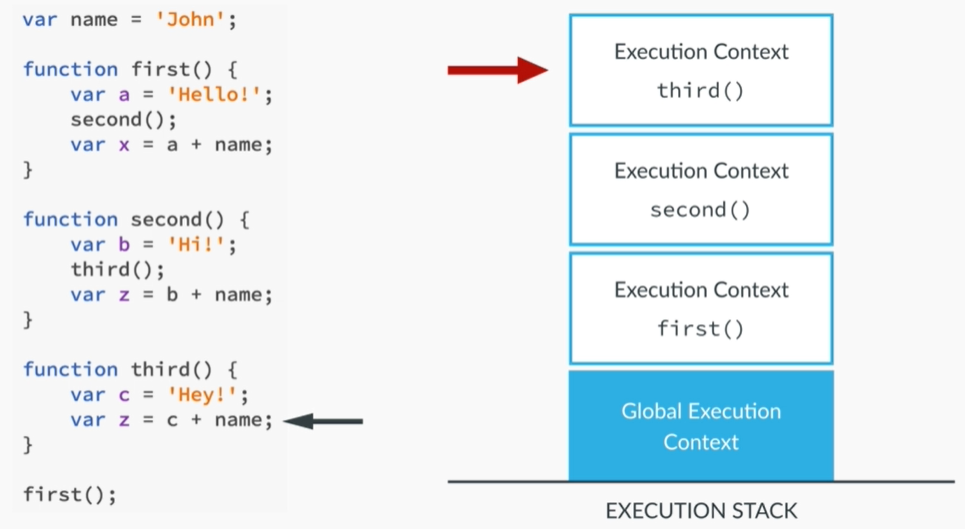
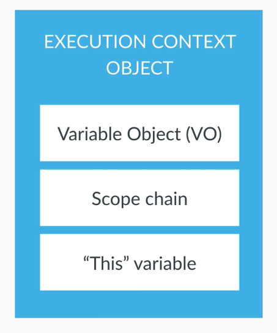
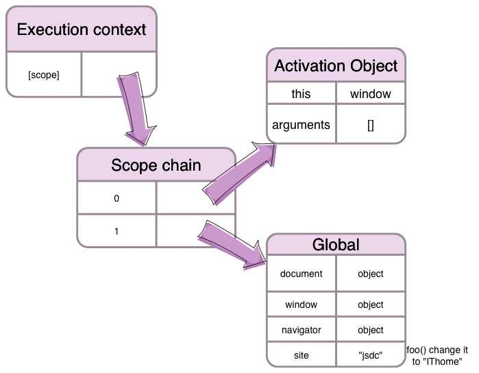

# 실행 컨텍스트(Execution Context)와 호이스팅(Hoisting)

> 이 글은 여러 문서와 아티클을 참고해서 제가 직접 작성한 글입니다.

<br>

## 실행 컨텍스트란?

실행 컨텍스트(Execution Context)는 Javascript 코드가 분석되고 실행되는 환경을 나타내는 추상적인 개념입니다. 쉽게 말해 실행 컨텍스트는 코드가 실행되고 있는 환경, 범위에 대한 개념입니다.

<br>

JavaScript의 실행 컨텍스트에는 3 종류가 있습니다.

- 전역 컨텍스트(Global Execution Context)

- 함수 컨텍스트(Functional Execution Context)

- Eval 함수 컨택스트(Eval Function Execution Context)

<br>

### 전역 컨텍스트(Global Execution Context)

디폴트, 기본 컨텍스트입니다. 특정 함수 내에서 실행되지 않는 모든 코드가 이 전역 컨텍스트에서 실행됩니다. 한 프로그램에서 단 하나의 전역 컨텍스트만이 존재할 수 있습니다.

전역 컨텍스트가 하는 일은 다음의 2가지 입니다.

- 전역 객체를 생성하고,
- `this`에 이 전역 객체를 할당합니다.

<br>

> 전역 객체(Global Object)는 모든 객체들의 최상위 객체를 의미합니다. 일반적으로 웹 브라우저에서는 `window`, 서버 사이드(Node.js)에서는 `global` 객체가 전역 객체입니다. `strict` 모드에서 전역 객체는 `undefined` 입니다.

<br>

### 함수 컨텍스트(Functional Execution Context)

함수가 호출될 때마다 함수의 실행을 위한 새로운 실행 컨텍스트가 생성되는데, 이를 함수 컨텍스트(Functional Execution Context)라고 합니다. 모든 함수는 자신만의 실행 컨텍스트를 가지는데, 함수의 실행 컨텍스트가 생성되는 시점은 그 함수가 호출되는 시점입니다.

<br>

### Eval 함수 컨택스트(Eval Function Execution Context)

`eval` 함수 내에서 실행되는 코드를 위한 실행 컨텍스트입니다.

<br>

## 실행 컨텍스트 스택(ECS, Execution context stack)

실행 컨텍스트를 담는 LIFO(Last In First Out) 스택 자료구조 입니다. 이 스택은 기본으로 전역 컨텍스트를 담고 있습니다. JS 엔진에서 전역 컨텍스트의 코드를 실행시키는 중 함수 호출이 발생하면, 스택의 가장 위에 호출된 함수의 실행 컨텍스트가 담깁니다. 새로운 컨택스트가 쌓였으므로, JS 엔진은 전역 컨텍스트의 실행을 멈추고 함수 컨텍스트의 작업을 시작합니다. 이런 식으로 함수가 호출될 때마다 새로운 실행 컨택스트가 생성되고 기존의 컨텍스트 위에 쌓입니다. 함수 컨텍스트의 모든 코드가 실행되면 실행이 완료된 컨텍스트를 걷어내고 정지되었던 컨텍스트들이 차례로 작업을 완료합니다. 모든 함수 컨텍스트의 작업이 완료된 후에 전역 컨택스트가 다시 실행됩니다.

<br>

아래의 그림을 참고하세요.

<br>



<br>

## 실행 컨텍스트가 그래서 뭐에요?

실행 컨텍스트는 코드가 분석되고 실행되는 환경을 나타내는 추상적인 개념이라고 위에서 언급했습니다. 하지만 물리적으로는 객체의 형태를 가집니다. 실행 컨텍스트 객체는 다음과 같은 몇 가지 프로퍼티를 가지고 있습니다.

- 변수 객체(Variable Object)
- 스코프 체인(Scope chain)
- `this`



<br>

### 1. 변수 객체(Variable Object)

변수 객체(Variable Object)는 모든 변수들의 선언 정보를 담는 특별한 객체입니다. 이 객체에 담기는 변수들의 선언 정보는 다음의 항목들을 포함합니다.

- 선언된 모든 변수(함수)
- 함수의 경우, 그 함수의 인자(Arguments)
- 함수 안에 선언된 또 다른 함수(Inner Function)

<br>

> 변수 객체의 다른 말은 활성 객체(Activation Object)입니다. 변수 객체는 코드가 실행될 때 JS 엔진에 의해 참조되며 코드에서는 접근할 수 없습니다.

<br>

예를 들어, 아래와 같은 코드가 있습니다.

```javascript
function funA(a, b) {
	var c = 3;

	var d = 2;

	d = function () {
		return a - b;
	};
}

funA(3, 2);
```

<br>

`funA` 함수가 호출되면 이 함수에 대한 실행 컨텍스트가 생성될 겁니다. 그 실행 컨텍스트 객체의 모습은 대략 아래와 같겠네요.

```javascript
executionContextObj = {
	variableObject: {},
	scopechain: [],
	this,
};
```

<br>

여기에서 `variableObject` 객체는 아래와 같이 구성될 겁니다.

```javascript
variableObject = {
  argumentObject : {
    0: a,
    1: b,
    length: 2
  },
  a: 3,
  b: 2
  c: undefined,
  d: undefined then pointer to the function defintion of d
}
```

먼저 함수 `funA`의 인자들에 대한 정보를 가진 객체 `argumentObject`가 있습니다. 함수의 인자들인 `a`, `b`가 있고, `a`, `b`에는 각각 함수가 호출될 때 주어진 값들이 할당되어 있습니다. 함수 내에서 선언된 변수들 `c`, `d`도 있네요.

<br>

### 2. 스코프 체인(Scope Chain)

변수 객체가 생성될 때 JS 엔진은 스코프 체인(Scope Chain)이라는 것을 만듭니다. 스코프 체인은 현재 함수가 참조할 수 있는 변수와 함수들의 선언 정보를 담고 있는 변수 객체들의 리스트입니다. 스코프 체인은 전역 컨텍스트의 변수 객체와 현재 실행되는 함수의 변수 객체를 포함합니다. 현재 실행중인 실행 컨텍스트의 변수 객체를 선두로 하여 순차적으로 상위 컨텍스트들의 변수 객체들이 리스트에 포함되며 마지막으로 전역 컨텍스트의 변수 객체를 포함합니다.



<br>

### 3. `this`

스코프 체인 생성이 완료되면, `this`에 값이 할당됩니다. `this`에 할당되는 값은 함수 호출 패턴에 의해 결정됩니다.

<br>

그럼, 실행 컨텍스트 객체는 언제 어떻게 생성될까요?

<br>

## 실행 컨텍스트가 생성되는 과정

JS 엔진은 다음의 2 단계 과정을 통해 실행 컨텍스트를 생성합니다.

- 생성 단계(Creation phase)
- 실행 단계(Execution phase)

<br>

### 생성 단계

생성 단계는 함수가 호출되었지만 아직 실행은 시작되지 않은 단계, 함수를 실행하기 위한 실행 컨텍스트를 생성하는 단계입니다. 이 단계에서 JS 엔진은 코드를 실행하지는 않고 스캔만 하면서 다음의 3가지 기능을 수행합니다.

- 변수 객체(VO, Variable Object) 생성
- 스코프 체인(Scope chain) 생성
- `this` 값 할당

<br>

### 실행 단계

실행 단계에 접어들면, JS 엔진은 변수 객체의 프로퍼티들에 값을 할당하기 위해 실행할 함수를 한 번 더 스캔합니다. 값들이 업데이트되면, 이제 코드를 실행합니다.

이 단계에서는 위의 예제에서 보았던 `variableObject` 객체가 아래와 같이 바뀝니다.

```javascript
variableObject = {
  argumentObject : {
    0: a,
    1: b,
    length: 2
  },
  a: 3,
  b: 2,
  c: 3, // value updated
  d: undefined then pointer to the function defintion of d
}
```

<br>

## 호이스팅(Hoisting)

> [이 영상](https://www.youtube.com/watch?v=ppMlvGMT2qE&feature=youtu.be)을 보는 것을 추천합니다.

호이스팅(Hoisting)이란 선언된 모든 변수들의 선언 정보가 코드가 실행되기 전에 최상단으로 끌어올려지는 현상입니다. 함수의 경우, 표현식이 아닌 선언식으로 작성되었다면 변수가 선언된 것과 같으므로 함수 선언식이 통째로 호이스팅 됩니다.

<br>

아래 코드는 어떻게 동작할까요? 이 코드에는 변수 `tmp`가 선언되어 있고, 선언식 함수 `print`가 있습니다.

```javascript
console.log(tmp); // output: undefined

console.log(tmp2); // output: undefined

print(); // output: 'Hello'

var tmp = "World";

var tmp2;

function print() {
	console.log("Hello");
}
```

변수를 선언하기 전에 호출하기 때문에 마치 에러가 날 것 같지만, 위 코드는 잘 작동합니다. 변수 `tmp`와 `tmp2`, 함수 `print`에 대한 선언이 호이스팅 되었기 때문입니다. 다시 말해 실행 컨텍스트의 변수 객체에 `tmp`, `tmp2`, `print`가 각각 프로퍼티로 담겨졌기 때문에 참조가 가능한 것입니다.

`console.log(tmp)`의 결과는 왜 `undefined` 일까요? 먼저, 에러가 나지 않고 `undefined`가 출력되는 이유는 변수 `tmp`가 호이스팅 되어 참조할 수 있는 상태이기 때문입니다. 한편 `var tmp = "World"` 코드에 의해 할당된 값은 아직 참조할 수 없으며 변수의 선언부만 호이스팅 되었다는 것을 알 수 있습니다.

<br>

표현식 함수의 경우에는 이야기가 다릅니다.

```javascript
expression(); // 에러 발생

// 함수 표현식 (호이스팅 피하기)
var expression = function () {
	console.log("expression");
};
```

익명 함수가 할당된 변수 `expression`을 이용해 해당 함수를 호출하는 코드에서 에러가 발생합니다. 이는 변수 `expression`의 선언은 호이스팅 되었지만 이 변수가 참조하고 있는 함수 표현식은 호이스팅 되지 않았기 때문입니다.

> 호이스팅 되는 변수들이 많아지면 JavaScript 코드의 실행은 그만큼 늦어집니다. 이는 성능에 좋지 않습니다. 위와 같이 함수 선언식 대신 함수 표현식을 이용해 함수가 통째로 호이스팅 되는 것을 피할 수 있습니다.

<br>

```javascript
console.log(expression); // output: undefined

// 함수 표현식
var expression = function () {
	console.log("expression");
};
```

위는 함수는 호출하지 않고, 변수 `expression`을 콘솔에 출력하는 코드입니다. 함수 표현식은 호이스팅 되지 않았지만 변수 `expression`의 선언은 호이스팅 된 것을 알 수 있네요.

<br>

아래는 함수 선언식과 그 함수를 호출하는 코드입니다. 함수 선언식은 호이스팅 됩니다. 함수 표현식의 경우와 비교해보세요.

```javascript
declaration(); // output: declaration

// 함수 선언식 - 선언과 동시에 초기화
function declaration() {
	console.log("declaration");
}
```

<br>

## 네이티브 객체(Native Built-in Objects)

[ECMAScript](https://developer.mozilla.org/ko/docs/Web/JavaScript/%EC%96%B8%EC%96%B4_%EB%A6%AC%EC%86%8C%EC%8A%A4)에 정의된 객체입니다. 애플리케이션 전역의 공통 기능을 제공하며, 애플리케이션의 환경과 관계없이 언제나 사용할 수 있습니다.

`Object`, `String`, `Number`, `Function`, `Array`, `RegExp`, `Date`, `Math`와 같은 객체 생성에 관계가 있는 함수 객체와 메소드로 구성됩니다.

> 네이티브 객체를 Global Objects라고도 합니다. 이는 전역 객체(Global object)와는 다른 의미이므로 혼동에 주의하세요.

<br>

---

### References

- [자바스크립트 언어 자료 | MDN](https://developer.mozilla.org/ko/docs/Web/JavaScript/%EC%96%B8%EC%96%B4_%EB%A6%AC%EC%86%8C%EC%8A%A4)
- [Understanding Execution Context and Execution Stack in Javascript](https://blog.bitsrc.io/understanding-execution-context-and-execution-stack-in-javascript-1c9ea8642dd0)
- [Execution context, Scope chain and JavaScript internals](https://medium.com/@happymishra66/execution-context-in-javascript-319dd72e8e2c)
- [실행 컨텍스트와 자바스크립트의 동작 원리](https://poiemaweb.com/js-execution-context)
- [실행 컨텍스트 | www.zerocho.com](https://www.zerocho.com/category/JavaScript/post/5741d96d094da4986bc950a0)
- [함수 표현식 vs 함수 선언식 | 캡틴판교님의 블로그](https://joshua1988.github.io/web-development/javascript/function-expressions-vs-declarations/)
