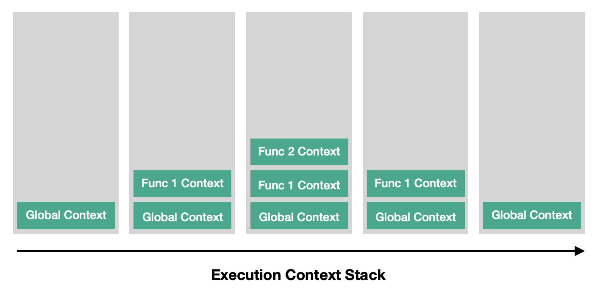

# 실행 컨텍스트(Execution Context)와 호이스팅(Hoisting)

<br>

## 실행 컨텍스트(Execution Context)

실행 컨텍스트(Execution Context)는 코드가 분석되고 실행되는 환경을 나타내는 추상적인 개념입니다. 쉽게 말해 코드가 실행되고 있는 환경, 범위에 대한 개념입니다.

<br>

JavaScript의 실행 컨텍스트에는 3 종류가 있습니다.

- 전역 컨텍스트(Global Execution Context)

- 함수 컨텍스트(Functional Execution Context)

- Eval 함수 컨텍스트(Eval Function Execution Context)

<br>

### 1) 전역 컨텍스트(Global Execution Context)

기본 컨텍스트입니다. 특정 함수 내에서 실행되지 않는 모든 코드가 이 전역 컨텍스트에서 실행됩니다. 전역 컨텍스트는 단 하나만 존재할 수 있습니다.

전역 컨텍스트가 하는 일은 다음과 같습니다.

- 전역 객체(Global object)를 생성하고,

- `this` 변수에 전역 객체를 할당합니다.

<br>

> 전역 객체(Global Object)란?

> 전역 객체는 모든 객체들의 최상위 객체를 의미합니다. 일반적으로 웹 브라우저에서는 `window`, 서버 사이드(Node.js)에서는 `global` 객체가 전역 객체입니다. `strict` 모드에서 전역 객체는 `undefined` 입니다.

<br>

### 2) 함수 컨텍스트(Functional Execution Context)

함수가 호출될 때마다 함수의 실행을 위한 새로운 실행 컨텍스트가 생성되는데, 이를 함수 컨텍스트(Functional Execution Context)라고 합니다. 모든 함수는 자신만의 실행 컨텍스트를 가집니다.

<br>

### 3) Eval 함수 컨텍스트(Eval Function Execution Context)

`eval` 함수의 실행 컨텍스트입니다.

<br>

## 실행 컨텍스트 스택(Execution context stack)

실행 컨텍스트들을 담는 LIFO(Last In First Out) 스택 자료구조 입니다. 이 스택은 기본으로 전역 컨텍스트를 담고 있습니다. JS 엔진에서 전역 컨텍스트의 코드를 실행시키는 중 함수 호출이 발생하면, 스택의 가장 위에 호출된 함수의 실행 컨텍스트가 담깁니다. 새로운 컨텍스트가 쌓였으므로, JS 엔진은 전역 컨텍스트의 실행을 멈추고 함수 컨텍스트의 작업을 시작합니다. 이런 식으로 함수가 호출될 때마다 새로운 실행 컨텍스트가 생성되고 기존의 컨텍스트 위에 쌓입니다. 함수 컨텍스트의 모든 코드가 실행되면 실행이 완료된 컨텍스트를 걷어내고 정지되었던 컨텍스트들이 차례로 작업을 완료합니다. 모든 함수 컨텍스트의 작업이 완료된 후에 전역 컨텍스트가 다시 실행됩니다.



<br>

## 실행 컨텍스트가 생성되는 과정

JS 엔진은 다음의 2 단계 과정을 통해 실행 컨텍스트를 생성합니다.

- 생성 단계(Creation phase)

- 실행 단계(Execution phase)

<br>

### 생성 단계

생성 단계는 함수가 호출되었지만 아직 실행은 시작되지 않은 단계, 함수를 실행하기 위한 실행 컨텍스트를 생성하는 단계입니다. 이 단계에서 JS 엔진은 코드를 실행하지는 않고 스캔만 하면서 다음의 3가지 기능을 수행합니다.

- 변수 객체(Variable Object) 생성

- 스코프 체인(Scope chain) 생성

- `this` 값 할당

<br>

위의 변수 객체, 스코프 체인, `this` 변수가 실행 컨텍스트의 구성 요소입니다.

<br>

실행 컨텍스트는 코드가 분석되고 실행되는 환경을 나타내는 추상적인 개념이라고 위에서 언급했습니다. 하지만 물리적으로는 이 3가지를 프로퍼티로 하는 객체의 형태를 가집니다. 그 모습은 대략 아래와 같겠네요.

```javascript
'executionContext': {
	variableObject: {},
	scopeChain: [],
	this,
};
```

<br>

#### 1) 변수 객체(Variable Object)

> 변수 객체의 다른 말은 활성 객체(Activation Object)입니다.

변수 객체(Variable Object)는 모든 변수들의 선언 정보를 담는 특별한 객체입니다. 이 객체에 담기는 변수들은 다음의 항목들을 포함합니다.

- 선언된 모든 변수(함수)

- 함수의 경우, 그 함수의 인자(Arguments)

- 내부 함수(Inner Function)

  > 내부 함수(Inner Function) : 함수 안에 선언된 또 다른 함수

<br>

#### 2) 스코프 체인(Scope Chain)

스코프 체인은 현재 실행 컨텍스트에서 참조할 수 있는 변수 객체들의 리스트입니다. 스코프 체인은 현재 실행되는 함수 자신의 변수 객체와 전역 컨텍스트의 변수 객체를 포함합니다. 현재 실행중인 실행 컨텍스트의 변수 객체를 선두로 하여 순차적으로 상위 컨텍스트들의 변수 객체들이 리스트에 포함되며 마지막으로 전역 컨텍스트의 변수 객체를 포함합니다.


<br>

#### 3) `this` 변수

스코프 체인 생성이 완료되면, `this`에 값이 할당됩니다. `this`에 할당되는 값은 함수 호출 패턴에 의해 결정됩니다.

<br>

#### Lexical Environment & Variable Environment

실행 컨텍스트는 사실 두 공간으로 나뉘어져 있습니다.(Lexical Environment, Variable Environment) ES6에서 이 둘의 차이는 다음과 같습니다.

- Lexical Environment : 함수 선언식, 변수 선언(`let`, `const`) 저장

- Variable Environment : 변수 선언(`var`) 저장

> 참고로, [ES6 공식문서](http://ecma-international.org/ecma-262/6.0/)에 정의된 Lexical Environment는 다음과 같습니다.

> A Lexical Environment is a specification type used to define the association of Identifiers to specific variables and functions based upon the lexical nesting structure of ECMAScript code. A Lexical Environment consists of an Environment Record and a possibly null reference to an outer Lexical Environment.

<br>

### 실행 단계

실행 단계로 접어들면, JS 엔진은 변수 객체의 프로퍼티들에 값을 할당하기 위해 실행할 함수를 한 번 더 스캔합니다. 값들이 업데이트되면, 드디어 코드를 실행합니다.

<br>

### 예제

웹 브라우저에서 아래의 코드를 실행한다고 가정하겠습니다. 이 경우에는 3 개의 컨텍스트가 생성됩니다.

```javascript
var name = "Estelle";

function print(job) {
	console.log(`${job} ${name}`);
}

function setName(newName) {
	var name = newName;
	console.log(name);
	print("Engineer");
}

setName("Bomm");
```

<br>

#### 1) 전역 컨텍스트 생성

가장 먼저, 전역 컨텍스트가 생성됩니다. 그 모습은 아래와 같을 겁니다.

```javascript
'globalExecutionContext': {
  variableObject: {
    arguments: null,
    name: undefined,
    print: Function,
    setName: Function
  },
  scopeChain: [globalExecutionContext.variableObject],
  this: window,
}
```

변수 객체 `variableObject`는 선언된 모든 변수들의 이름을 담고 있습니다. 여기에는 (함수 컨텍스트의 경우) 인자들의 정보를 담고 있는 `arguments` 프로퍼티도 있는데요, 전역 컨텍스트에는 인자가 없으므로 인자 정보를 담는 `arguments` 프로퍼티의 값은 `null` 입니다. 전역 컨텍스트의 스코프 체인 `scopeChain` 리스트에는 자기 자신인 전역 변수 객체만 포함되고, `this`에는 `window` 객체가 할당됩니다.

<br>

#### 2) `setName` 함수 컨텍스트

전역 컨텍스트에서 코드가 실행되다가 `setName('Bomm')` 코드를 만나면 함수 `setName`이 호출됩니다. 이때 함수 컨텍스트가 생성됩니다. 아래의 모습으로요.

```javascript
'setNameContext': {
  variableObject: {
    arguments: {
      0: newName
      length: 1
    },
    newName: 'Bomm',
    name: undefined,
  },
  scopeChain: [setNameContext.variableObject, globalExecutionContext.variableObject],
  this: window,
}
```

변수 객체의 `arguments` 프로퍼티에 함수의 인자에 대한 정보가 담깁니다. 그리고 인자인 `newName`은 함수가 호출되는 순간 선언과 동시에 값 대입이 되었기 때문에 컨텍스트 내에서도 값이 할당되어 있습니다. 함수 내부에서 선언된 `name` 변수도 있습니다. `scopeChain` 리스트에는 자기 자신의 변수 객체와 상위의 전역 변수 객체가 담깁니다.

이제 이 컨텍스트 안에서 코드가 실행됩니다.

<br>

```javascript
function setName(newName) {
	var name = newName;
	console.log(name); // output: 'Bomm'
	print("Engineer");
}
```

이 부분인데요, 아래의 순서로 코드가 실행됩니다.

- 변수 `name`에 인자 `newName`의 값을 할당합니다. 변수 `name`은 자기 자신의 컨텍스트에서 찾습니다.

- `console.log(name)`가 실행됩니다. `name` 변수에 할당된 값 `'Bomm'`이 콘솔에 출력됩니다.

- `print` 함수를 호출합니다. `print` 함수의 실행 컨텍스트가 생성됩니다. `setName` 함수의 컨텍스트는 잠시 실행을 멈춥니다.

<br>

#### 3) `print` 함수 컨텍스트

```javascript
'printContext': {
  variableObject: {
    arguments: {
      0: job
      length: 1
    },
    job: 'Engineer'
  },
  scopeChain: [printContext.variableObject, globalExecutionContext.variableObject],
  this: window,
}
```

`print` 함수의 실행 컨텍스트는 위와 같습니다. 그런데 `scopeChain` 리스트를 보면, 상위의 스코프라고 생각했던(`print` 함수가 호출된 스코프인) `setName` 함수의 변수 객체가 없습니다. 이것은 JavaScript가 렉시컬 스코프(<strong>Lexical Scope</strong>)를 따르기 때문입니다. 렉시컬 스코프에 따라, `print` 함수의 스코프 체인은 함수가 호출된 `setName` 컨텍스트가 아닌, 함수가 선언된 전역 컨텍스트를 상위 스코프로 합니다.

```javascript
function print(job) {
	console.log(`${job} ${name}`); // output: 'Engineer Estelle'
}
```

이제 코드를 실행합니다. 이때 필요한 `name` 변수는 이 컨텍스트의 변수 객체에 없기 때문에, 스코프 체인을 따라 올라가 상위의 전역 변수 객체에서 찾게 됩니다. 따라서 콘솔에 출력되는 값은 `'Engineer Bomm'`이 아닌 `'Engineer Estelle'`이 됩니다.

<br>

`print` 함수의 실행이 종료되면 `print` 함수 컨텍스트가 사라지고, `setName` 함수의 실행이 마무리됩니다. 이후 `setName` 함수 컨텍스트도 사라지고, 마지막에는 전역 컨텍스트도 사라지면서 실행 컨텍스트 스택이 비워집니다.

<br>

> 렉시컬 스코프(Lexical Scope)가 무엇인지 모른다면, 저의 [다른 글](https://github.com/estellechoi/TIL/blob/master/javascript/scope.md)을 참고하세요.

<br>

## 호이스팅(Hoisting)

> [이 영상](https://www.youtube.com/watch?v=ppMlvGMT2qE&feature=youtu.be)을 보는 것을 추천합니다.

호이스팅(Hoisting)은 선언된 모든 변수들의 선언 정보가 코드가 실행되기 전에 최상단으로 끌어올려지는 현상입니다. 함수의 경우, 표현식이 아닌 선언식으로 작성되었다면 함수 선언식이 통째로 호이스팅 됩니다.

<br>

아래 코드는 어떻게 동작할까요? 이 코드에는 변수 `tmp`, `tmp2`가 선언되어 있고, `print` 함수 선언식이 있습니다.

```javascript
console.log(tmp); // output: undefined

console.log(tmp2); // output: undefined

print(); // output: 'Hello'

var tmp = "World";

var tmp2;

function print() {
	console.log("Hello");
}
```

변수를 선언하기 전에 호출하기 때문에 마치 에러가 날 것 같지만, 위 코드는 잘 작동합니다. 변수 `tmp`와 `tmp2`, `print` 함수 선언식이 호이스팅 되었기 때문입니다. 다시 말해 실행 컨텍스트의 변수 객체에 `tmp`, `tmp2`, `print`가 각각 프로퍼티로 담겨졌기 때문에 참조가 가능한 것입니다.

`console.log(tmp)`의 결과는 왜 `undefined` 일까요?

먼저, 에러가 나지 않고 `undefined`가 출력되는 이유는 변수 `tmp`가 호이스팅 되어 참조할 수 있는 상태이기 때문입니다. 한편, 아직 `var tmp = 'World'` 코드가 실행된 것은 아니므로 값은 할당되어 있지 않습니다.

<br>

### 함수 선언식과 함수 표현식의 호이스팅

(간단히 말해) 함수 선언식과 달리, 함수 표현식은 호이스팅 되지 않습니다.

```javascript
expression(); // 에러 발생

// 함수 표현식 (호이스팅 피하기)
var expression = function () {
	console.log("expression");
};
```

<br>

위 코드를 실행시키면, 가장 첫 줄 `expression()`에서 에러가 발생합니다. 에러 메세지는 다음과 같습니다.

```
TypeError: expression is not a function
```

이는 변수 `expression`의 선언은 호이스팅 되었지만, `expression`에 함수가 할당되는 코드는 아직 실행되지 않았기 때문입니다. `expression`은 아직 함수가 아닌데, 함수를 실행하라고 하니까 에러가 발생하는 거죠.

<br>

```javascript
console.log(expression); // output: undefined

// 함수 표현식
var expression = function () {
	console.log("expression");
};
```

위는 함수는 호출하지 않고, 변수 `expression`을 콘솔에 출력하는 코드입니다. 변수 `expression`가 호이스팅 된 것을 알 수 있네요.

<br>

> 호이스팅 되는 변수들이 많아지면 JavaScript 코드의 실행은 그만큼 늦어집니다. 이는 성능에 좋지 않습니다. 위와 같이 함수 선언식 대신 함수 표현식을 이용해 함수가 통째로 호이스팅 되는 것을 피할 수 있습니다.

<br>

아래는 함수 선언식과 그 함수를 호출하는 코드입니다. 함수 선언식은 호이스팅 됩니다. 함수 표현식의 경우와 비교해보세요.

```javascript
declaration(); // output: 'declaration'

// 함수 선언식 - 선언과 동시에 초기화
function declaration() {
	console.log("declaration");
}
```

<br>

### TDZ(Temporal Dead Zone): `let`, `const`와 호이스팅

`let`, `const` 키워드로 선언한 변수는 호이스팅 되지 않는 걸까요?

```javascript
console.log(str); // ReferenceError

const str = "apple";
```

위의 코드를 볼게요. 호이스팅 규칙에 따르면 `console.log(str)` 코드는 `'apple'`을 출력해야 할 것 같은데, `ReferenceError` 에러가 발생합니다. 이는 `let`, `const` 키워드로 선언된 변수는 TDZ(Temporal Dead Zone)에 영향을 받기 때문입니다. 쉽게 말하면, 잠시 접근할 수 없는 상태에 있는 겁니다.

<br>

변수 `str`은 호이스팅 되었지만, 접근할 수 없을 뿐입니다.

<br>

#### TDZ(Temporal Dead Zone)란?

호이스팅 되었지만, (실행중인 코드에서) 아직 선언되지 않은 변수가 있는 곳을 말합니다. TDZ에 있는 변수에는 접근할 수 없으며, 변수가 선언되는 지점에 TDZ에서 나오게 됩니다.

<br>

```javascript
let val = "out Scope";

function test() {
	console.log(val); // ReferenceError
	let val = "inner scope"; // val 초기화 - escape from TDZ
}

test();
```

위의 코드에서 `test` 함수 내에 `let` 키워드로 선언한 변수 `val`이 호이스팅 되지 않는다고 가정해보겠습니다. 그렇다면, `test` 함수를 호출했을 때 전역 변수에 할당된 값 `'out Scope'`가 출력되어야 합니다.

실제 결과는 `'out Scope'`가 출력되지 않고 `ReferenceError` 에러가 발생합니다. 즉, 호이스팅은 되었지만 아직 TDZ에 있기 때문에 접근할 수 없는 것입니다. 실행 컨텍스트가 생성될 때 `let`/`const` 변수 선언은 Lexical Environment에 저장됩니다. 하지만 초기화(값 바인딩)되기 전까지는 접근할 수 없는 TDZ 상태에 있게 됩니다.

> `var` 변수 선언은 Variable Environment에 따로 저장되며, TDZ에 영향을 받지 않습니다.

<br>

변수가 초기화된다는 것은 무엇일까요? TDZ는 변수에 값이 할당될 때가 아닌, 변수가 선언될 때 끝납니다.

<b>The TDZ ends when a variable is declared, rather than assigned.</b>

> 위 문장은 Stackoverflow의 [What is the temporal dead zone?](https://stackoverflow.com/questions/33198849/what-is-the-temporal-dead-zone) 답변에서 가져왔습니다. 이 답변은 많은 useful 평가를 받았습니다.

<br>

```javascript
let tmp;
console.log(tmp); // output : undefined

tmp = 10;
console.log(tmp); // output: 10
```

변수 `tmp`에 값이 할당되지 않았지만, 선언되었기 때문에 TDZ에 있지 않습니다. 이때 변수 `tmp`에는 `undefined`가 바인딩되어 있습니다(초기화 되어있습니다).

<br>

---

### References

- [자바스크립트 언어 자료 | MDN](https://developer.mozilla.org/ko/docs/Web/JavaScript/%EC%96%B8%EC%96%B4_%EB%A6%AC%EC%86%8C%EC%8A%A4)
- [Understanding Execution Context and Execution Stack in Javascript](https://blog.bitsrc.io/understanding-execution-context-and-execution-stack-in-javascript-1c9ea8642dd0)
- [Execution context, Scope chain and JavaScript internals](https://medium.com/@happymishra66/execution-context-in-javascript-319dd72e8e2c)
- [실행 컨텍스트와 자바스크립트의 동작 원리 | poiemaweb.com](https://poiemaweb.com/js-execution-context)
- [실행 컨텍스트 | www.zerocho.com](https://www.zerocho.com/category/JavaScript/post/5741d96d094da4986bc950a0)
- [함수 표현식 vs 함수 선언식 | 캡틴판교님의 블로그](https://joshua1988.github.io/web-development/javascript/function-expressions-vs-declarations/)
- [Lexical Scope and Dynamic Scope | bestalign's dev blog](https://bestalign.github.io/2015/07/12/Lexical-Scope-and-Dynamic-Scope/)
- [Don't Use JavaScript Variables Without Knowing Temporal Dead Zone](https://dmitripavlutin.com/javascript-variables-and-temporal-dead-zone/)
