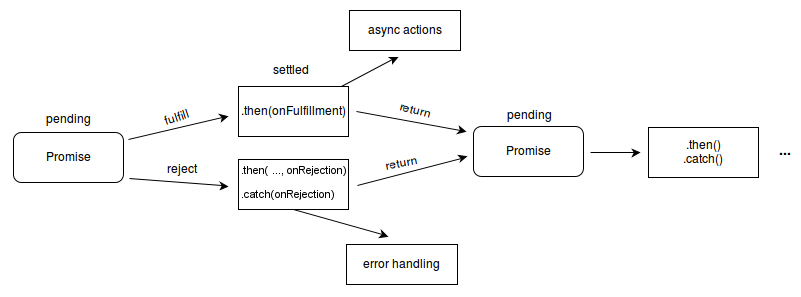

# How Javascript works ?

> This markdown page is just a combination of several recommended articles. The only goal of this page is to help people dig into how JavaScript actually works on this page rather than wandering around from here to there.

<br>

## JavaScript Engine

A JavaScript engine is a program or an interpreter which executes JavaScript code. A popular example of a JavaScript Engine is Google’s V8 engine. The V8 engine is used inside Chrome and also for Node.js runtime.
<br>


The Engine consists of two main components:

- Memory Heap : where the memory allocation happens
- Call Stack : where your stack frames are as your code executes

> For more examples of JavaScript Engine, see [here](https://blog.sessionstack.com/how-javascript-works-inside-the-v8-engine-5-tips-on-how-to-write-optimized-code-ac089e62b12e).

<br>

> How V8 engine works? there is my another markdown page, see [here](https://github.com/estellechoi/TIL/blob/master/javascript/v8.md). It is written in Korean.

<br>

## JavaScript Runtime

For JavaScript runtime, we have the engine but there is actually a lot more. We have those things called Web APIs which are provided by browsers, like the DOM, AJAX, setTimeout and many more. And then, we have the so popular event loop and the callback queue.


<br>

## The Call Stack

JavaScript is a single-threaded programming language, which means it has a single Call Stack. Therefore it can do one thing at a time. <strong>The Call Stack is a data structure, which records basically where in the program we are.</strong>

If we step into a function, we put it on the top of the stack. If we return from a function, we pop off the top of the stack. That’s all the stack can do.

<br>

For example,

```javascript
function multiply(x, y) {
	return x * y;
}

function printSquare(x) {
	var s = multiply(x, x);
	console.log(s);
}

printSquare(5);
```

When the engine starts executing this code, the Call Stack would be empty. Afterwards, the steps will be the following:


<br>

Each entry in the Call Stack is called a Stack Frame. And this is how stack traces are being constructed when an exception is being thrown — it is basically the state of the Call Stack when the exception happened.

For example with the below code,

```javascript
function foo() {
	throw new Error("SessionStack will help you resolve crashes :)");
}

function bar() {
	foo();
}

function start() {
	bar();
}

start();
```

If this is executed in Chrome, the following stack trace will be produced like`At foo` as you see.


<br>

### Blowing the stack

This happens when you reach the maximum Call Stack size. And that could happen quite easily, especially if you’re using recursion without testing your code very extensively.

> 번역 : 스택이 쌓이다가 한도 사이즈를 초과하면 "스택 날려버리기"가 발생합니다. 이는 꽤 쉽게 발생할 수 있는데요, 재귀 코드를 광범위하게 테스트하지 않았을 때 특히 그렇습니다.

> 재귀란, 자신을 정의할 때 자기 자신을 재참조하는 방법입니다.

<br>

For example with this recursive code,

```javascript
function foo() {
	foo(); // recursion
}

foo();
```

Call stack gets looking something like this:


At some point the number of function calls in the Call Stack exceeds the actual size of the Call Stack, and the browser decides to take action, by throwing an error like this:


<br>

As you see, running on a single thread is quite limiting.

<br>

## The Lack of concurrency

The problem is that while the Call Stack has functions to execute, the browser can’t actually do anything else — it’s getting blocked. This means that the browser can’t render, it can’t run any other code, it’s just stuck.

So, how can we execute heavy code without blocking the UI? The solution is <strong>asynchronous callbacks</strong>.

<br>

## Asynchronous callbacks

In JavaScript the most common block unit is the function. only one of blocks is going to execute now, and the rest will execute later.

It is important to understand that <b>later</b> doesn’t necessarily happen strictly and immediately after <b>now</b>. This is because, instead of immediately returning some result like most functions, some functions take some time to produce a result. In other words, tasks that cannot complete now are going to complete <strong>asynchronously</strong>, which means you won’t have the above-mentioned blocking behavior.

<br>

### Asynchronous execution

You can have any chunk of code execute asynchronously. For example, this can be done with the `setTimeout(callback, milliseconds)` function.

```javascript
function first() {
	console.log("first");
}

function second() {
	console.log("second");
}

function third() {
	console.log("third");
}

first();
setTimeout(second, 1000); // asynchronous execution
third();
```

The output will be:

```
first
third
second
```

<br>

### Why callbacks are needed?

Let's see the below example.

```javascript
// ajax(..) is some arbitrary Ajax function given by a library
const response = ajax("https://example.com/api");

// `response` won't have any value.
console.log(response);
```

You’re probably aware that standard `Ajax` requests don’t complete synchronously, which means that at the time of code execution the `ajax(..)` function does not yet have any value to return back. Nothing is to be assigned to `const response` variable.

<br>

A simple way of “waiting” for an asynchronous function to return its result is to use a function called callback. See the below.

```javascript
ajax("https://example.com/api", (response) => {
	console.log(response);
});
```

> Note: Though you can actually make synchronous Ajax requests, never, ever do that. If you make a synchronous Ajax request, the UI of your JavaScript app will be blocked — the user won’t be able to click, enter data, navigate, or scroll.

<br>

## Event Loop

### Who tells the JS Engine to execute multiple chunks of your program?

Despite allowing async JavaScript code (like the `setTimeout`), until ES6, JavaScript itself has actually never had any direct notion of asynchrony built into it.

So, who tells the JS Engine to execute multiple chunks of your program? The event loop does, which is a built-in mechanism in all environments where JS Engine runs inside. The event loop handles the execution of multiple chunks of your program over time, each time invoking the JS Engine.

> In reality, the JS Engine doesn’t run in isolation — it runs inside a hosting environment, which is the typical web browser or Node.js. Actually, nowadays, JavaScript gets embedded into all kinds of devices, from robots to light bulbs. Every single device represents a different type of hosting environment for the JS Engine. This means that the JS Engine is just an on-demand execution environment for any JS code. It’s the surrounding environment that schedules the events(the JS code executions).

<br>

When your JavaScript program makes an `Ajax` request to fetch some data, you set up a callback function. And the JS Engine tells the hosting environment:

“Hey, I’m going to suspend execution of this block for now, but whenever you finish with that network request, and you have some data, please call this function back.”

The browser is then set up to listen for the response from the network. An when it has something to return to you, it will schedule the callback function to be executed by inserting it into the event loop.

<br>

### What is the event loop after all?


The Event Loop has one simple job:

- to monitor the Call Stack and the Callback Queue. If the Call Stack is empty, it will take the first event from the Callback queue and will push it to the Call Stack. And the Event Loop keeps doing this repeatedly.

Such an iteration is called a "tick" in the Event Loop. Each event is just a function callback.

<br>

> See this [video](https://www.youtube.com/watch?v=8aGhZQkoFbQ) titled "What the heck is the event loop anyway?".

<br>

### Event Loop Working Process

Let’s execute this code and see what happens.

```javascript
console.log("Hi");

setTimeout(function cb1() {
	console.log("cb1");
}, 5000);

console.log("Bye");
```

#### 1. The browser console is clear, and the Call Stack is empty.


<br>

#### 2. `console.log('Hi')` is added to the Call Stack.


<br>

#### 3. `console.log('Hi')` is executed.


<br>

#### 4. `console.log('Hi')` is removed from the Call Stack.


<br>

#### 5. `setTimeout(function cb1() { ... })` is added to the Call Stack.


<br>

#### 6. `setTimeout(function cb1() { ... })` is executed.

The browser creates a timer as part of the Web APIs. It is going to handle the countdown for you.


<br>

#### 7. `The setTimeout(function cb1() { ... })` itself is complete and removed from the Call Stack.

The timer keeps hadling the countdown.


<br>

#### 8. `console.log('Bye')` is added to the Call Stack.


<br>

#### 9. `console.log('Bye')` is executed.


<br>

#### 10. `console.log('Bye')` is removed from the Call Stack.


<br>

#### 11. After at least 5000 ms, the timer completes and it pushes the `cb1` callback to the Callback Queue.


<br>

#### 12. The Event Loop takes `cb1` from the Callback Queue and pushes it to the Call Stack.


<br>

#### 13. `cb1` is executed and adds `console.log('cb1')` to the Call Stack.


<br>

#### 14. `console.log('cb1')` is executed.


<br>

#### 15. `console.log('cb1')` is removed from the Call Stack.


<br>

#### 16. `cb1` is removed from the Call Stack.


<br>

> It’s interesting to note that ES6 specifies how the event loop should work. It means that technically the event loop is within the scope of the JS engine’s responsibilities, no longer playing just a hosting environment role. One main reason for this change is the introduction of Promises in ES6 because the latter requires access to a direct, fine-grained control over scheduling operations on the event loop queue.

<br>

### How `setTimeout(callback, 0)` works

It’s important to note that `setTimeout()` doesn’t automatically put your callback on the event loop queue. It sets up a timer. When the timer expires, the environment places your callback into the event loop, so that some future tick will pick it up and execute it.

<br>

For example,

```javascript
setTimeout(myCallback, 1000);
```

This code doesn’t mean that `myCallback` function will be executed in 1,000 ms but rather that, in 1,000 ms `myCallback` will be added to the queue. The queue, however, might have other events that have been added earlier — your callback will have to wait. calling `setTimeout(callback, 0)` just puts off the callback until the Call Stack is clear.

<br>

```javascript
console.log("Hi");

setTimeout(function () {
	console.log("callback");
}, 0);

console.log("Bye");
```

Although the wait time is set to 0 ms, the output is:

```
Hi
Bye
callback
```

<br>

## What are Jobs in ES6 ?

A new concept called the "Job Queue" was introduced in ES6. It’s a layer on top of the Event Loop queue. Imagine it like this: the Job Queue is a queue that’s attached to the end of every tick in the Event Loop queue.

During a tick of the event loop, async actions will not cause a whole new event to be added to the event loop queue, but will instead add a <b>Job</b> to the end of the current tick’s Job queue. This means that you can add another functionality to be executed later, and you can rest assured that it will be executed right after, before anything else. A Job can also cause more Jobs to be added to the end of the same queue. In theory, it’s possible for a Job loop (a Job that keeps adding other Jobs, etc.) to spin indefinitely.

> The Job queue is used mostly for asynchronous behavior of Promises.

<br>

## The limit of Callbacks in asynchronous execution

### 1. Callback hell

```javascript
listen("click", function (e) {
	setTimeout(function () {
		ajax("https://api.example.com/endpoint", function (text) {
			if (text == "hello") {
				doSomething();
			} else if (text == "world") {
				doSomethingElse();
			}
		});
	}, 500);
});
```

We’ve got a chain of three functions nested together, each one representing a step in an asynchronous series. This kind of code is often called a Callback Hell. The cause of Callback Hell is when people try to write JavaScript code in a way where execution happens visually from top to bottom.

A sequential way of expressing the async code is needed.

<br>

> To dig into Callback Hell, [callbackhell.com](http://callbackhell.com/) would be a good start.

<br>

### 2. Uncaught exceptions

```javascript
try {
	setTimeout(function () {
		throw new Error("Error!");
	}, 1000);
} catch (e) {
	console.log(e);
}
```

This callback function throws an error, but the error would be not caught. This is because the caller of the callback is not the `setTimeout()` but the event loop. When the call stack has nothing more to execute, the event loop calls back a callback function. At that time, `setTimeout()` has already been removed from the runtime and never exists. Any exception handled in `catch { .. }` statement should be from `setTimeout()` not the callback. So, how can be the errors from callbacks handled?

<br>

## Promise

A `Promise` is an object representing the eventual completion or failure of an asynchronous operation. A `Promise` is a proxy for a value not necessarily known when the promise is created. This lets asynchronous methods return values like synchronous methods: instead of immediately returning the final value, the asynchronous method returns a promise to supply the value at some point in the future.

<br>

A `Promise` is in one of these states:

- `pending` : initial state, neither fulfilled nor rejected.
- `fulfilled` : that the operation completed successfully.
- `rejected` : that the operation failed.

<br>

See the below using `setTimeout()` to simulate async code. In reality, you will probably be using something like XHR or an HTML5 API.

```javascript
const promise = new Promise((resolve, reject) => {
	setTimeout(function () {
		resolve("Success!");
	}, 1000);
});

promise.then((response) => {
	console.log(response);
});
```

We call `resolve()` when what we were doing asynchronously was successful, and `reject()` when it failed. The two methods are given by `Promise`.

A pending promise can either be fulfilled with a value, or rejected with a reason. When either of these results happens, the associated handlers queued up by a promise's `then()` method are called. the `response` is whatever we passed as an argument in the `resolve()` function above. As the `Promise.prototype.then()` and `Promise.prototype.catch()` methods return promises, they can be chained.



<br>

## What’s happening in ES8? Async/await

JavaScript ES8 introduced `async`/`await` that makes the job of working with Promises easier. So, let’s see how `async`/`await` works.

> The purpose of `async`/`await` is to simplify the behavior of using promises.

<br>

### `async`

You define an asynchronous function using the `async` function declaration. Such functions return an [`AsyncFunction`](https://developer.mozilla.org/en-US/docs/Web/JavaScript/Reference/Global_Objects/AsyncFunction) object. When an async function is called, it returns a `Promise`. When the async function returns a value, that’s not a `Promise`. a `Promise` will be automatically created and it will be resolved with the returned value from the function. When the `async` function throws an exception, the `Promise` will be rejected with the thrown value.

<br>

<br>

#### Example

This is a standard JavaScript function.

```javascript
function getNumber1() {
	return Promise.resolve("374");
}
```

<br>

The below function does the same as `getNumber1()`.

```javascript
async function getNumber2() {
	return 374;
}
```

<br>

In the case of exception, it works the same. The functions with `async` declaration that are throwing exceptions are equivalent to functions which return promises that have been rejected.

```javascript
function f1() {
	return Promise.reject("Some error");
}
```

<br>

With `async`,

```javascript
async function f2() {
	throw "Some error";
}
```

<br>

### `await`

An async function can contain an `await` expression, that pauses the execution of the function and waits for the passed `Promise`’s resolution, and then resumes the async function’s execution and returns the resolved value. The `await` keyword can only be used in `async` functions and allows you to synchronously wait on a `Promise`. If you use promises outside of an `async` function, you’ll still have to use `then` callbacks.

<br>

### `async` function expression

An `async` function expression can be used as an IIFE (Immediately Invoked Function Expression) which runs as soon as it is defined.

For example like this,

```javascript
const loadData = async function () {
	// `rp` is a request-promise function.
	const promise1 = rp("https://api.example.com/endpoint1");
	const promise2 = rp("https://api.example.com/endpoint2");

	// we'll have to wait for them to finish
	const response1 = await promise1;
	const response2 = await promise2;
	return `${response1} ${response2}`;
};
```

<br>

## Browser compatibility ragarding `async`/`await`


`async`/`await` is supported in all major browsers. If this compatibility is not what you are after, there are also several JS transpilers like [Babel](https://babeljs.io/docs/en/babel-plugin-transform-async-to-generator/) and [TypeScript](https://www.typescriptlang.org/docs/handbook/release-notes/typescript-2-3.html).

<br>

> You can search the same at [Can I use](https://caniuse.com/#search=promise).

<br>

## The benefits of using `async`/`await`

### 1. Clean code

Every time you use `async`/`await` you skip a few unnecessary steps: write `.then`, create an anonymous function to handle the response, name the response from that callback e.g.

Without `async`/`await`,

```javascript
// `rp` is a request-promise function.
rp(`https://api.example.com/endpoint1`).then(function (data) {
	//..
});
```

<br>

```javascript
const response = await rp(`https://api.example.com/endpoint1`);
```

<br>

### 2. Error handling simplicity

`async`/`await` makes it possible to handle both sync and async errors with the same code construct — the well-known `try`/`catch` statements.

<br>

Without `async`/`await`,

```javascript
function loadData() {
	try {
		getJSON()
			.then((response) => {
				const parsed = JSON.parse(response);
				console.log(parsed);
			})
			.catch((e) => {
				// Catches asynchronous errors
				console.log(e);
			});
	} catch (e) {
		// Catches synchronous errors.
		console.log(e);
	}
}
```

<br>

With `async`/`await`,

```javascript
async function loadData() {
	try {
		const data = JSON.parse(await getJSON());
		console.log(data);
	} catch (e) {
		console.log(e);
	}
}
```

<br>

## JavaScript Working Process


<br>

---

### References

- [How JavaScript works: an overview of the engine, the runtime, and the call stack](https://blog.sessionstack.com/how-does-javascript-actually-work-part-1-b0bacc073cf)
- [How JavaScript works: Event loop and the rise of Async programming + 5 ways to better coding with async/await](https://blog.sessionstack.com/how-javascript-works-event-loop-and-the-rise-of-async-programming-5-ways-to-better-coding-with-2f077c4438b5)
- [callbackhell.com](http://callbackhell.com/)
- [자바스크립트 Promise 쉽게 이해하기](https://joshua1988.github.io/web-development/javascript/promise-for-beginners/)
- [poiemaweb.com](https://poiemaweb.com/es6-promise)
- [JavaScript Promises: An introduction | Google developers](https://web.dev/promises/)
- [Using Promises | MDN](https://developer.mozilla.org/en-US/docs/Web/JavaScript/Guide/Using_promises)
