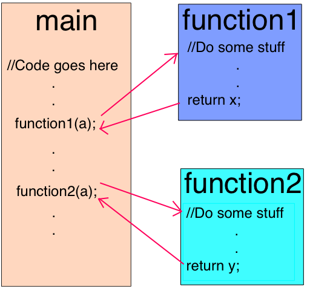
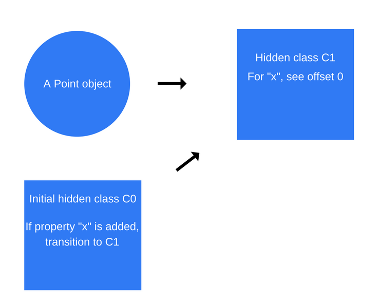
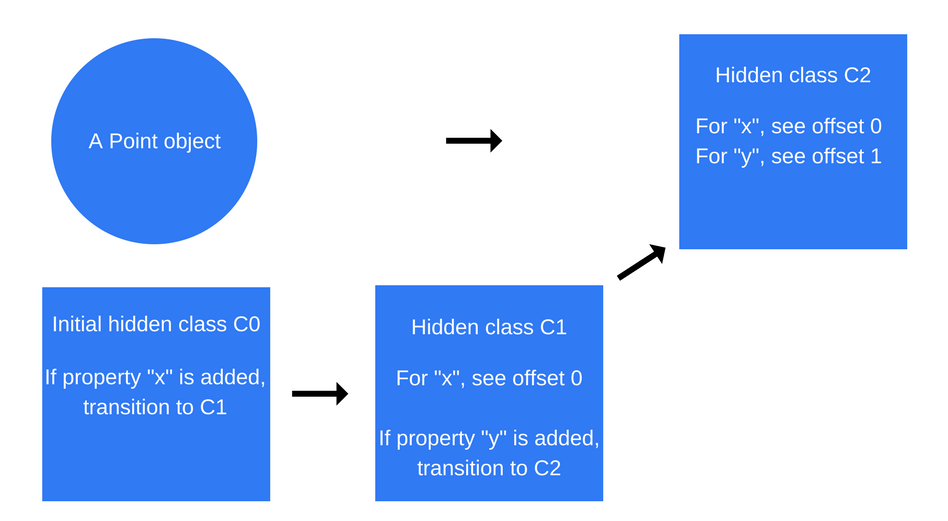

# V8

> This markdown page is the English-Korean translated version of [How JavaScript works: inside the V8 engine + 5 tips on how to write optimized code](https://blog.sessionstack.com/how-javascript-works-inside-the-v8-engine-5-tips-on-how-to-write-optimized-code-ac089e62b12e). Note that some parts were omitted or revised with additional explanation.

> This page is in the middle of working. [Bomin](https://github.com/bomniekim) is working together.

<br>

## V8 엔진

V8은 구글에서 만든 JavaScript 엔진입니다. V8 엔진은 Chrome 브라우저 내에서 사용되며, 다른 엔진들과 달리 Node.js의 런타임이기도 합니다.

아래는 유명한 JavaScript 엔진 구현 프로젝트들입니다.

- V8 : 오픈 소스, 구글에서 개발, 개발언어는 C++
- Rhino : 오픈 소스, Mozilla Foundation에서 관리, 개발언어는 Java
- SpiderMonkey : 최초의 JavaScript 엔진, Firefox 브라우저에서 사용됨 (구 Netscape Navigator)
- JavaScriptCore : 오픈 소스, Apple 사에서 개발, Safari 브라우저에서 사용됨, Nitro로 알려져 있음
- KJS : Harri Porten이 개발한 KDE의 엔진, Konqueror 브라우저를 위해 개발됨
- Chakra (JScript9) : Internet Explorer 브라우저에서 사용됨
- Chakra (JavaScript) : Microsoft Edge 브라우저에서 사용됨
- Nashorn : 오픈 소스, OpenJDK 일부
- JerryScript : IoT에서 사용하기 위한 가벼운 엔진

<br>

## V8 엔진은 왜 만들어졌나 ?

V8 엔진은 웹 브라우저 내에서 JavaScript 실행 성능을 높이기 위해 고안되었습니다.

V8 엔진은 JavaScript의 실행 속도를 높이기 위해 인터프리터를 사용하지 않습니다. 대신 JavaScript를 (바이트 코드나 그 어떤 중간 형태의 코드로 변환하지 않고) 바로 머신코드로 변환합니다. JavaScript 코드가 실행되는 즉시 머신 코드로 컴파일된다는 점에서 V8 엔진을 JIT(Just-In-Time) 컴파일러라고 합니다.

<br>

## V8 엔진은 2 개의 컴파일러를 사용했었다

5.9 버전 이전에는 2 개의 컴파일러를 사용했습니다.

- full-codegen : 간단하고 매우 빠른 컴파일러, 간단하고 비교적 느린 머신코드로 변환
- Crankshaft : 보다 복잡한 JIT 최적화 컴파일러, 최적화된 코드로 변환

<br>

V8 엔진은 내부적으로 여러 개의 쓰레드를 사용합니다.

- 메인 쓰레드 : 코드를 가져오고, 컴파일하고, 실행
- 컴파일 쓰레드 : 메인 쓰레드가 코드를 계속 실행할 수 있도록 코드를 최적화
- 프로파일러(Profiler) 쓰레드 : 많은 시간이 소요되는 메소드를 알려주어 Crankshaft의 최적화 작업을 도움
- Garbage Collector를 핸들링하기 위한 몇 가지 기타 쓰레드들

### full-codegen

처음 JavaScript 코드를 실행하면, V8 엔진은 파싱된 JavaScript를 머신 코드로 바로 변환하기 위해 full-codegen 컴파일러를 이용합니다. 덕분에 빠르게 머신 코드 실행에 착수할 수 있습니다.

### Crankshaft

한편, 코드가 실행되는 동안 프로파일러 쓰레드는 어떤 메소드가 시간을 많이 잡아먹는지 데이터를 모으고, 이 데이터를 바탕으로 "이 메소드를 최적화해야 합니다"는 결정을 내려서 Crankshaft 컴파일러에 알려줍니다.

Crankshaft 컴파일러의 최적화 작업은 또 다른 쓰레드에서 진행됩니다. Crankshaft 컴파일러는 JavaScript의 문법 트리를 Hydrogen이라고 불리는 [SSA(Static single assignment)](https://en.wikipedia.org/wiki/Static_single_assignment_form) 형태의 그래프로 변환하고, Hydrogen 그래프를 최적화하는 작업을 진행합니다. 대부분의 최적화 작업이 이 단계에서 수행됩니다.

<br>

## 최적화 작업

### 인라이닝(Inlining)

첫번째 최적화 작업은 코드 인라이닝(Inlining) 작업입니다. 인라이닝 작업은 함수를 호출하는 코드 라인을 호출되는 함수의 실제 내부 로직으로 대체하는 것입니다.



<br>

### 숨겨진 클래스(Hidden class)

JavaScript는 프로토타입 기반 언어입니다. 다시 말해, 복제된 클래스나 객체가 존재하지 않습니다. 또한 JavaScript는 동적 프로그래밍 언어이고, 따라서 객체를 인스턴스화하면 그 속성을 쉽게 추가하거나 제거할 수 있습니다.

대부분의 JavaScript 인터프리터는 메모리에 할당된 객체의 속성 값 주소를 저장하기 위해 사전과 비슷한 구조를 사용합니다. 이는 Java, C# 등의 언어와는 다른 점입니다.

예를 들어 Java는 정해진 객체 레이아웃이 있고, 이에 따라 객체의 모든 속성들이 컴파일되기 전에 결정됩니다. 런타임에서 속성들을 동적으로 추가/삭제할 수 없습니다. 속성들의 offset 역시 미리 정해지며, 속성들이 메모리에 연속적인 버퍼 형태로 저장되는 것이 가능합니다. offset의 길이는 속성의 타입에 따라 결정됩니다.

반면 JavaScript는 런타임에서 속성의 타입이 언제든 변할 수 있기 때문에 offset의 길이를 미리 정할 수 없습니다. (C#에서는 동적 타입을 채택하고 있지만, 이건 또 다른 주제이므로 넘어가겠습니다)

메모리에서 속성들의 위치를 찾기 위해 사전형 구조를 채택하는 것은 매우 비효율적입니다. 대신 V8 엔진은 숨겨진 클래스(Hidden class)를 이용해 이 문제를 해결합니다. 이름에서도 알 수 있듯이 비록 JavaScript에는 클래스가 없지만, 엔진 내부에 숨겨진 클래스 개념을 두는 것입니다. 이 숨겨진 클래스는 Java의 고정된 객체 레이아웃과 비슷하지만, 런타임에서 생성된다는 점에서 다릅니다.

<br>

숨겨진 클래스가 무엇인지 코드를 통해 살펴보겠습니다.

```javascript
function Point(x, y) {
	this.x = x;
	this.y = y;
}

var p1 = new Point(1, 2);
```

`new Point(1, 2)`가 실행되면, V8 엔진은 <b>C0</b>라는 클래스를 생성합니다. 이 때, `Point` 객체 내에 정의된 속성들이 없으므로 클래스 <b>C0</b>은 완전히 비어있는 상태입니다.

`Point` 함수 내의 `this.x = x` 코드가 실행되면 속성 `x`가 `Point` 객체에 추가되므로, V8 엔진은 두 번째 클래스인 <b>C1</b>을 생성합니다. 클래스 <b>C1</b>은 속성 `x`의 메모리 내의 위치를 나타냅니다. 이때 생성되는 <b>C1</b>은 <b>C0</b>에 기반하기 때문에, 클래스 <b>C0</b>이 <b>C1</b>으로 업데이트된다고 합니다.(Class Transition)

> 이때 `x`는 offset 0(첫 번째 offset)에 저장됩니다.



이 과정은 `this.y = y` 코드가 실행될 때도 마찬가지로 반복됩니다. 이미 속성 `x`를 갖고 있는 `Point` 객체에 속성 `y`가 추가되므로, 새로운 클래스 `C2`가 생성되고 Class Transition이 발생합니다.



<br>

위에서 보았듯이 숨겨진 클래스들의 전환은 객체에 속성들이 추가되는 순서과 관련이 있습니다.

예를 들어,

```javascript
function Point(x, y) {
	this.x = x;
	this.y = y;
}

var p1 = new Point(1, 2);
p1.a = 5;
p1.b = 6;

var p2 = new Point(3, 4);
p2.b = 7;
p2.a = 8;
```

위의 코드를 보고 `p1` 과 `p2` 에서 똑같은 클래스 전환이 발생할거라고 생각할 수 있지만, 그렇지 않습니다. 각 인스턴스에서 객체 `Point`에 속성 `a`와 `b`가 추가되는 순서가 다르기 때문입니다. 이런 경우에는, 동일한 순서로 속성들이 추가되도록 코드를 작성하는 것이 좋습니다. 그래야 숨겨진 클래스의 재사용이 가능하기 때문입니다.

<br>

### 인라인 캐싱(Inline caching)

인라인 캐싱은 동적 타입을 가진 언어들을 최적화하는 기술입니다. 이 기술은 같은 메소드를 반복적으로 호출하는 경우가 동일한 타입의 객체에 대해 발생하는 경향이 있다는 점에서 착안되었습니다. (인라인 캐싱을 딥하게 살펴볼 여유가 없는 당신을 위해) 인라인 캐싱의 대략적인 컨셉을 먼저 설명하겠습니다.

그래서 어떻게 동작할까요?

V8 엔진은 호출된 함수의 파라미터로 전달된 객체의 타입을 캐시로 유지하고, 이 정보를 토대로 미래에 같은 타입의 객체가 파라미터로 전달된다고 가정합니다. 이를 통해 V8 엔진은 후에 같은 타입의 객체가 파라미터로 전달될 때 객체의 속성들에 어떻게 접근할지 찾아내는 과정을 겪지 않고, 캐시에 저장된 숨겨진 클래스의 정보를 이용할 수 있습니다.

> 원문 : If V8 is able to make a good assumption about the type of object that will be passed to a method, it can bypass the process of figuring out how to access the object’s properties, and instead, use the stored information from previous lookups to the object’s hidden class.

그렇다면 숨겨진 클래스와 인라인 캐싱은 서로 어떠한 관계를 가지고 있을까요? 특정 객체에서 메소드가 호출될 때 마다, V8 엔진은 특정 속성에 접근하기 위한 offset이 몇 번째 offset인지 결정하기 위해 그 객체에 해댱하는 숨겨진 클래스를 참조해야 합니다.

같은 숨겨진 클래스를 참조하는 같은 메소드를 2번 호출하는데 성공하면, V8 엔진은 심플하게 그 속성에 대한 offset을 객체 포인터 자체에 추가하고, 숨겨진 클래스를 찾는 것은 생략합니다.

후에 발생할 모든 메소드 호출에 대하여, V8 엔진은 숨겨진 클래스가 바뀌지 않았다는 가정 하에 어떤 속성의 메모리 주소를 직접 참조합니다. 이때 이전에 저장해놓은 offset을 사용합니다. 잉를 통해 JavaScript 실행 속도를 높일 수 있습니다.

인라인 캐싱은 같은 타입의 객체가 하나의 숨겨진 클래스를 공유한다는 점에서도 매우 중요합니다. 우리가 앞에서 본 예제와 같이 서로 다른 숨겨진 클래스를 가진 같은 타입의 객체가 2개 생성된 경우, V8 엔진은 인라인 캐싱을 이용할 수 없습니다. 2개의 객체가 같은 타입이라 할지라도, 각각의 객체가 참조하는 숨겨진 클래스는 각 객체의 속성이 추가된 순서에 따라 서로 다른 offset을 각 속성에 할당하기 때문입니다.


<br>

### 머신코드로 컴파일하기

Once the Hydrogen graph is optimized, Crankshaft lowers it to a lower-level representation called Lithium. Most of the Lithium implementation is architecture-specific. Register allocation happens at this level.
In the end, Lithium is compiled into machine code. Then something else happens called OSR: on-stack replacement. Before we started compiling and optimizing an obviously long-running method, we were likely running it. V8 is not going to forget what it just slowly executed to start again with the optimized version. Instead, it will transform all the context we have (stack, registers) so that we can switch to the optimized version in the middle of the execution. This is a very complex task, having in mind that among other optimizations, V8 has inlined the code initially. V8 is not the only engine capable of doing it.
There are safeguards called deoptimization to make the opposite transformation and reverts back to the non-optimized code in case an assumption the engine made doesn’t hold true anymore.

<br>

### Garbage collection

For garbage collection, V8 uses a traditional generational approach of mark-and-sweep to clean the old generation. The marking phase is supposed to stop the JavaScript execution. In order to control GC costs and make the execution more stable, V8 uses incremental marking: instead of walking the whole heap, trying to mark every possible object, it only walk part of the heap, then resumes normal execution. The next GC stop will continue from where the previous heap walk has stopped. This allows for very short pauses during the normal execution. As mentioned before, the sweep phase is handled by separate threads.

<br>

### Ignition and TurboFan

With the release of V8 5.9 earlier in 2017, a new execution pipeline was introduced. This new pipeline achieves even bigger performance improvements and significant memory savings in real-world JavaScript applications.
The new execution pipeline is built on top of Ignition, V8’s interpreter, and TurboFan, V8’s newest optimizing compiler.
You can check out the blog post from the V8 team about the topic here.
Since version 5.9 of V8 came out, full-codegen and Crankshaft (the technologies that have served V8 since 2010) have no longer been used by V8 for JavaScript execution as the V8 team has struggled to keep pace with the new JavaScript language features and the optimizations needed for these features.
This means that overall V8 will have much simpler and more maintainable architecture going forward.

These improvements are just the start. The new Ignition and TurboFan pipeline pave the way for further optimizations that will boost JavaScript performance and shrink V8’s footprint in both Chrome and Node.js in the coming years.
Finally, here are some tips and tricks on how to write well-optimized, better JavaScript. You can easily derive these from the content above, however, here’s a summary for your convenience:

<br>

## How to write optimized JavaScript

### 1. Order of object properties:

always instantiate your object properties in the same order so that hidden classes, and subsequently optimized code, can be shared.

<br>

### 2. Dynamic properties:

adding properties to an object after instantiation will force a hidden class change and slow down any methods that were optimized for the previous hidden class. Instead, assign all of an object’s properties in its constructor.

<br>

### 3. Methods:

code that executes the same method repeatedly will run faster than code that executes many different methods only once (due to inline caching).

<br>

### 4. Arrays:

avoid sparse arrays where keys are not incremental numbers. Sparse arrays which don’t have every element inside them are a hash table. Elements in such arrays are more expensive to access. Also, try to avoid pre-allocating large arrays. It’s better to grow as you go. Finally, don’t delete elements in arrays. It makes the keys sparse.

<br>

### 5. Tagged values:

V8 represents objects and numbers with 32 bits. It uses a bit to know if it is an object (flag = 1) or an integer (flag = 0) called SMI (SMall Integer) because of its 31 bits. Then, if a numeric value is bigger than 31 bits, V8 will box the number, turning it into a double and creating a new object to put the number inside. Try to use 31 bit signed numbers whenever possible to avoid the expensive boxing operation into a JS object.

<br>

---

### References

- 원문 : [How JavaScript works: inside the V8 engine + 5 tips on how to write optimized code](https://blog.sessionstack.com/how-javascript-works-inside-the-v8-engine-5-tips-on-how-to-write-optimized-code-ac089e62b12e)
