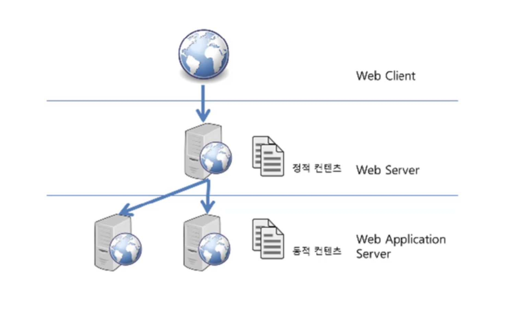

# 웹서버 (Web Server) 와 웹 어플리케이션 서버(Web Application Server)

## 웹서버 (Web Server) 란 ?
- 웹 서버는 보통 소프트웨어를 말하지만, 웹 서버 소프트웨어가 동작하는 컴퓨터를 말하기도 한다.
- 웹 서버의 가장 중요한 기능은 클라이언트(Client)가 요청하는 HTML 문서나 각종 리소스(Resource)를 전달하는 것이다.
- 웹 브라우저나 웹 크롤러가 요청하는 리소스는 컴퓨터에 저장된 정적(static)인 데이터이거나 동적인 결과가 될 수 있다.
	 - 정적인 데이터 : HTML, 이미지, CSS, JavaScript 파일 등 컴퓨터에 저장되어있는 파일들
	 - 동적인 결과 : 웹서버 프로그램에 의해 만들어진 결과물

## 클라이언트/서버 구조
- 클라이언트(Client)는 서비스(Service)를 제공하는 서버(Server)에게 정보를 요청하여 응답 받은 결과를 사용한다.
- 물리적인 하나의 컴퓨터에는 여러 개의 서버가 동작할 수 있다.
- 각각의 서버들은 서로 다른 포트(port) 번호로 구분되어 동작한다.
	 - 웹 서버의 디폴트 port = 80번

## DBMS (Database Management System) 와 미들웨어 (Middle Ware)
- DBMS : MySQL, MariaDB 등이 있다.
- 미들웨어 (Middle Ware)
	 - 클라이언트 쪽에 비즈니스 로직이 많을 경우, 클라이언트 관리(배포 등)로 인해 비용이 많이 발생하고 보안에 취약하다는 단점이 있었다.
	 - 비즈니스 로직을 클라이언트와 DBMS 사이의 미들웨어 서버에서 동작하도록 함으로써 클라이언트는 입출력만 담당하도록 한다.

## 웹 어플리케이션 서버 (WAS, Web Application Server) 란 ?
- 일종의 미들웨어로 웹 클라이언트(웹브라우저)의 요청 중 웹 어플리케이션이 동작하도록 지원한다.
- WAS 의 주요 기능
	 - 프로그램 실행 환경과 데이터베이스 접속 환경을 제공한다.
	 - 여러 개의 트랜젝션을 관리한다.
	 - 업무를 처리하는 비즈니스 로직을 수행한다.
- WAS 는 보통 자체적으로 웹 서버 기능을 내장하고 있다.
	 - 덕분에 Apache 같은 웹 서버 없이, Tomcat 과 같은 WAS 만으로도 웹어플리케이션 구현이 가능하다.
	 - 하지만 대용량 웹어플리케이션의 경우 장애 극복(Failover), 배포 및 유지보수의 편의성을 위해 웹서버와 WAS를 분리해서 사용한다.  -> 무중단 서비스 가능

***

  ### Reference
    - edwith \[부스트코스\] 웹 프로그래밍 교육자료
